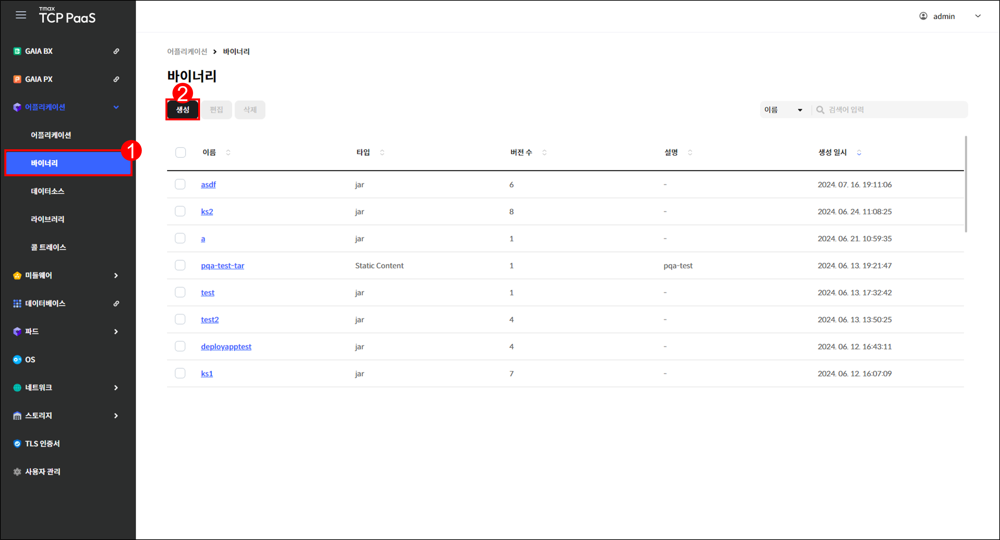
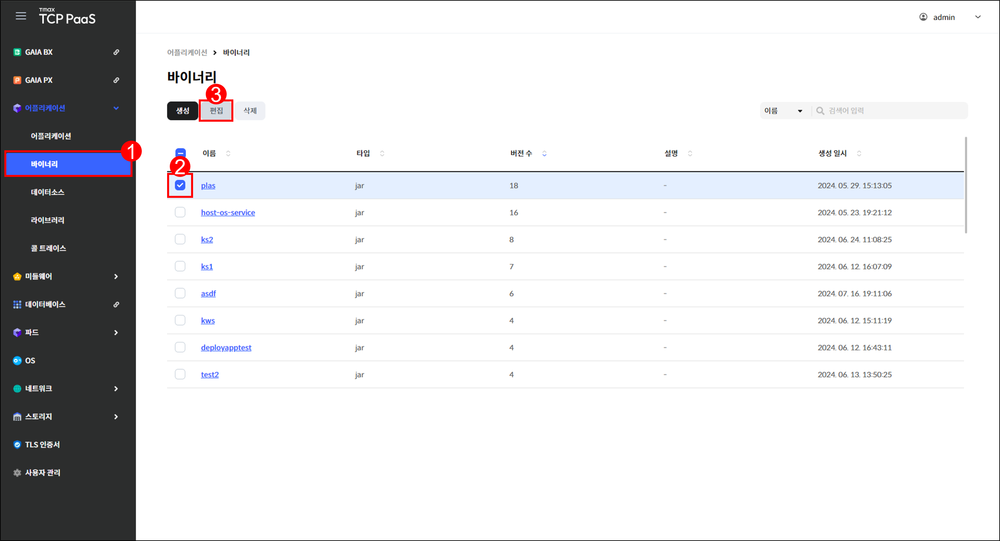

# 1.2 바이너리

## 바이너리 화면

메뉴 영역에서 `어플리케이션` > `바이너리`를 차례로 클릭하여 바이너리 화면을 확인할 수 있습니다.

<figure><figcaption>
[그림 1.2.1] 바이너리 화면 구성
</figcaption></figure>

1.  버튼을 클릭하여 다음을 실행할 수 있습니다.&#x20;

    <table><thead><tr><th width="118">버튼</th><th width="303">기능</th><th>활성화 조건</th></tr></thead><tbody><tr><td><code>생성</code></td><td>바이너리 생성 창을 표시합니다.</td><td>-</td></tr><tr><td><code>편집</code></td><td>선택한 바이너리의 편집 페이지로  이동합니다.</td><td>한 개의 바이너리를 선택해야 합니다.</td></tr><tr><td><code>삭제</code></td><td>선택한 바이너리의 삭제 창을 표시 합니다.</td><td>한 개 이상의 바이너리를 선택해야  합니다.</td></tr></tbody></table>
2. 드롭다운 메뉴에서 항목을 선택하고 검색어를 입력하여 바이너리를 검색할 수 있습니다.
3.  생성한 바이너리를 조회할 수 있습니다.

    <table><thead><tr><th width="116">항목</th><th>설명</th></tr></thead><tbody><tr><td>이름</td><td>바이너리의 이름</td></tr><tr><td>타입</td><td>
바이너리의 타입
<ul><li><code>jar</code></li><li><code>war</code></li><li><code>staticContent</code></li></ul></td></tr><tr><td>버전 수</td><td>바이너리에 추가된 버전 수</td></tr><tr><td>설명</td><td>바이너리에 대한 상세 설명</td></tr><tr><td>생성 일시</td><td>바이너리가 생성된 시각</td></tr></tbody></table>
4. 체크 박스를 클릭하여 바이너리를 선택할 수 있습니다.
5. 바이너리의 이름을 클릭하면 해당 바이너리의 상세 페이지로 이동합니다.

***

## 바이너리 생성

<figure><figcaption>
[그림 1.2.2] 바이너리 생성 버튼
</figcaption></figure>

1. 메뉴 영역에서 `어플리케이션` > `바이너리`를 클릭합니다.&#x20;
2. 바이너리 페이지가 열리면 `생성`을 클릭합니다.

<figure><figcaption>
[그림 1.2.3] 바이너리 생성 창
</figcaption></figure>

3.  생성할 바이너리의 정보를 입력합니다.

    <table><thead><tr><th width="102">항목</th><th>설명</th></tr></thead><tbody><tr><td>이름 <mark style="color:red;"><strong>*</strong></mark></td><td>바이너리의 이름</td></tr><tr><td>타입</td><td>
바이너리의 타입
<ul><li><code>jar</code></li><li><code>war</code></li><li><code>staticContent</code></li></ul></td></tr><tr><td>설명</td><td>바이너리에 대한 상세 설명</td></tr></tbody></table>
4. 입력을 완료한 후 `저장`을 클릭합니다.

***

## 바이너리 편집


**참고**

어플리케이션에서 사용 중인 바이너리는 편집할 수 없습니다.


<figure><figcaption>
[그림 1.2.4] 바이너리 편집 버튼
</figcaption></figure>

1. 메뉴 영역에서 `어플리케이션` > `바이너리`를 클릭합니다.
2. 편집할 바이너리에 체크합니다.
3. `편집`을 클릭합니다.

<figure><figcaption>
[그림 1.2.5] 바이너리 편집 창
</figcaption></figure>

4. 바이너리의 이름과 설명을 편집할 수 있습니다.
5. 편집을 완료한 후 `저장`을 클릭합니다.

***

## 바이너리 삭제


**참고**

어플리케이션에서 사용 중이거나 버전이 1 이상인 바이너리는 삭제할 수 없습니다.


<figure><figcaption>
[그림 1.2.6] 바이너리 삭제 창
</figcaption></figure>

1. 메뉴 영역에서 `어플리케이션` > `바이너리`를 클릭합니다.
2. 삭제할 바이너리에 체크한 후 `삭제`를 클릭합니다.
3. 삭제 창이 열리면 `삭제`를 클릭합니다.

***

## 바이너리 상세

<figure><figcaption>
[그림 1.2.7] 바이너리 조회 페이지
</figcaption></figure>

1. 메뉴 영역에서 `어플리케이션` > `바이너리`를 클릭합니다.
2. 상세 정보를 확인할 바이너리의 이름을 클릭합니다.

<figure><figcaption>
[그림 1.2.8] 바이너리 상세 페이지
</figcaption></figure>

3.  버튼을 클릭하여 다음을 실행할 수 있습니다.

    <table><thead><tr><th width="159">버튼</th><th>기능</th></tr></thead><tbody><tr><td><code>액션</code> > <code>편집</code></td><td>해당 바이너리의 편집 창을 표시합니다.</td></tr><tr><td><code>액션</code> > <code>삭제</code></td><td>해당 바이너리의 삭제 창을 표시합니다.</td></tr></tbody></table>
4.  바이너리의 상세 정보를 조회할 수 있습니다.&#x20;

    <table><thead><tr><th width="162">항목</th><th>설명</th></tr></thead><tbody><tr><td>이름</td><td>바이너리의 이름</td></tr><tr><td>타입</td><td>
바이너리의 타입
<ul><li><code>jar</code></li><li><code>war</code></li><li><code>staticContent</code></li></ul></td></tr><tr><td>설명</td><td>바이너리에 대한 상세 설명</td></tr><tr><td>생성 일시</td><td>바이너리가 생성된 시각</td></tr></tbody></table>
5.  버전 탭에서는 바이너리 버전을 조회할 수 있습니다. 탭 내 버튼에 관한 설명은 "[버전 탭 내 버튼](1.2-binary.md#undefined-5)"을 참고하기 바랍니다.

    <table><thead><tr><th width="164">항목</th><th>설명</th></tr></thead><tbody><tr><td>버전</td><td>버전의 이름</td></tr><tr><td>파일</td><td>버전 추가 시 업로드한 파일 이름</td></tr><tr><td>설명</td><td>버전에 대한 상세 설명</td></tr><tr><td>추가 일시</td><td>버전이 추가된 시각</td></tr></tbody></table>

#### 버전 탭 내 버튼



<figure><figcaption>
[그림 1.2.9] 바이너리 버전 추가 버튼
</figcaption></figure>

1. `추가`를 클릭합니다.

<figure><figcaption>
[그림 1.2.10] 바이너리 버전 추가 창
</figcaption></figure>

2.  추가할 바이너리의 버전 정보를 입력합니다. 업로드할 파일을 회색 칸 안으로 드래그 앤 드롭하거나 `업로드`를 클릭하여 업로드할 파일을 선택할 수 있습니다.

    <table><thead><tr><th width="108">항목</th><th width="294">설명</th><th>제약 조건</th></tr></thead><tbody><tr><td>버전 <mark style="color:red;"><strong>*</strong></mark></td><td>버전 정보</td><td>버전 중복 불가</td></tr><tr><td>파일 <mark style="color:red;"><strong>*</strong></mark></td><td>업로드할 파일</td><td>-</td></tr><tr><td>설명</td><td>바이너리 버전에 대한 상세 설명</td><td>-</td></tr></tbody></table>
3. 입력을 완료한 후 `저장`을 클릭합니다.



<figure><figcaption>
[그림 1.2.11] 바이너리 버전 다운로드 버튼
</figcaption></figure>

1. 다운로드할 바이너리 버전에 체크합니다.
2. `다운로드`를 클릭합니다.



<figure><figcaption>
[그림 1.2.12] 바이너리 버전 편집 버튼
</figcaption></figure>

1. 편집할 바이너리 버전에 체크합니다.
2. `편집`을 클릭합니다.

<figure><figcaption>
[그림 1.2.13] 바이너리 버전 편집 창
</figcaption></figure>

3.  추가할 바이너리의 버전 정보를 입력합니다. 업로드할 파일을 회색 칸 안으로 드래그 앤 드롭하거나 `업로드`를 클릭하여 업로드할 파일을 선택할 수 있습니다.

    <table><thead><tr><th width="151">항목</th><th>설명</th><th>제약 조건</th></tr></thead><tbody><tr><td>버전 <mark style="color:red;"><strong>*</strong></mark></td><td>버전 정보</td><td>버전 중복 불가</td></tr><tr><td>파일 <mark style="color:red;"><strong>*</strong></mark></td><td>업로드할 파일</td><td>-</td></tr><tr><td>설명</td><td>바이너리 버전에 대한 상세 설명</td><td>-</td></tr></tbody></table>
4. 입력을 완료한 후 `저장`을 클릭합니다.




**참고**

어플리케이션으로 사용 중인 바이너리 버전은 삭제할 수 없습니다.


<figure><figcaption>
[그림 1.2.14] 바이너리 버전 삭제 창
</figcaption></figure>

1. 삭제할 바이너리 버전에 체크한 후 `삭제`를 클릭합니다.
2. 삭제 창이 열리면 `삭제`를 클릭합니다.


