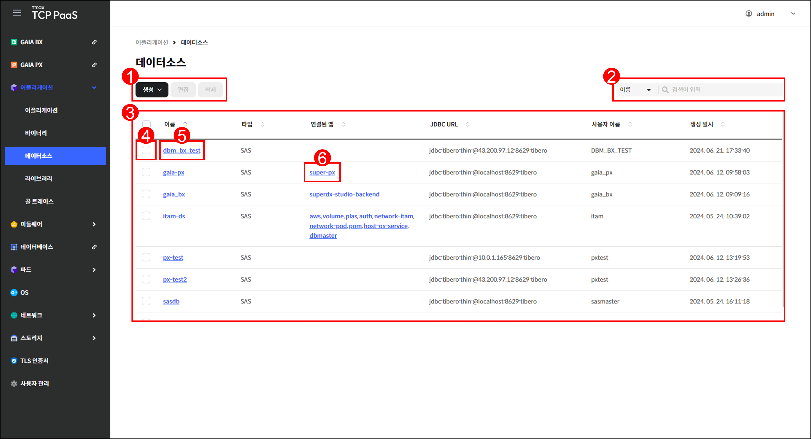
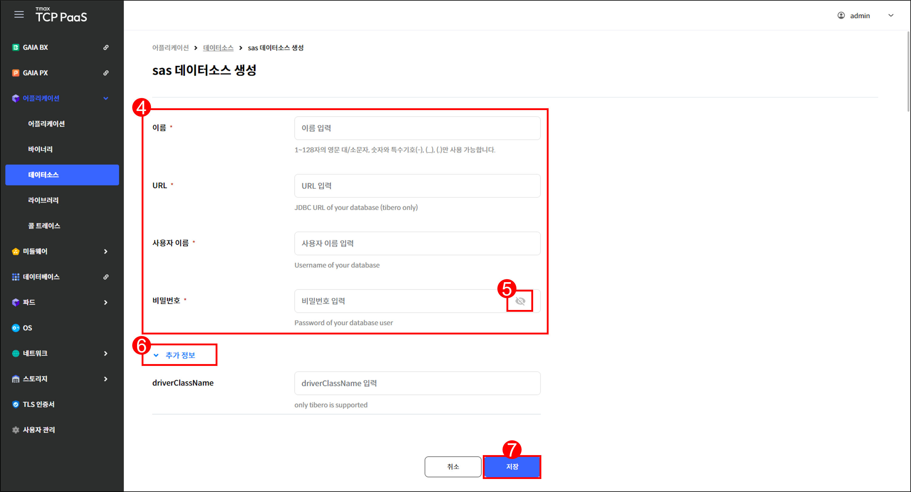
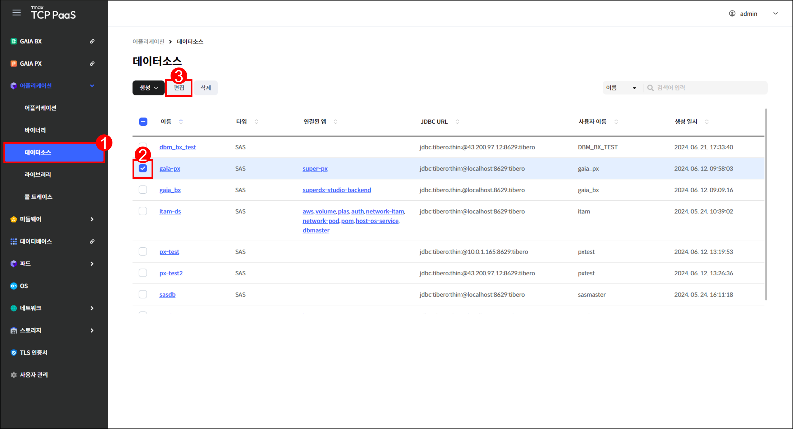
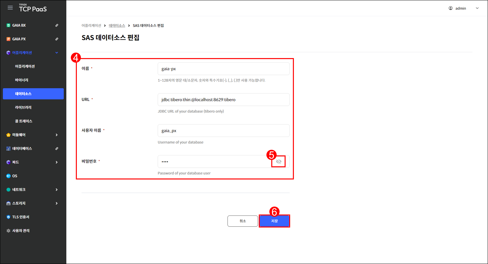
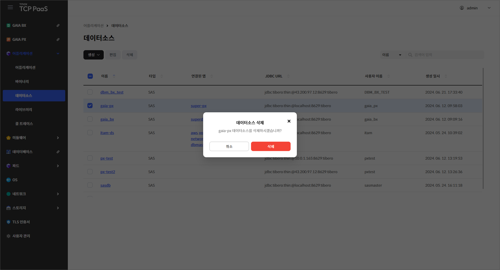
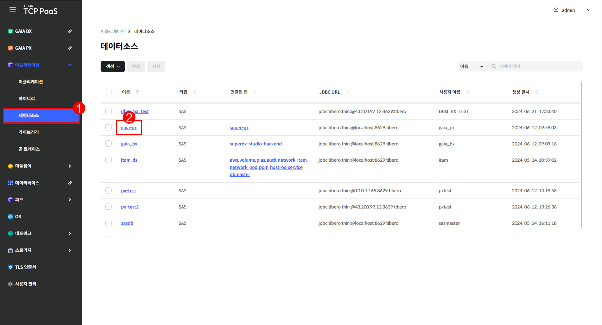

# 1.3 데이터소스

## 데이터소스 화면

메뉴 영역에서 `어플리케이션` > `데이터소스`를 차례로 클릭하여 데이터소스 화면을 확인할 수 있습니다.

<figure><figcaption>
[그림 1.3.1] 데이터소스 화면 구성
</figcaption></figure>

1.  버튼을 클릭하여 다음을 실행할 수 있습니다.&#x20;

    <table><thead><tr><th width="159">버튼</th><th width="296">기능</th><th>활성화 조건</th></tr></thead><tbody><tr><td><code>생성</code> > <code>SAS</code></td><td>sas 데이터소스 생성 페이지로 이동 합니다.</td><td>-</td></tr><tr><td><code>생성</code> > <code>Tomcat</code></td><td>tomcat 데이터소스 생성 페이지로  이동합니다.</td><td>-</td></tr><tr><td><code>편집</code></td><td>선택한 데이터소스의 편집 페이지로  이동합니다.</td><td>한 개의 데이터소스를 선택해야  합니다.</td></tr><tr><td><code>삭제</code></td><td>선택한 데이터소스의 삭제 창을 표시 합니다.</td><td>한 개 이상의 데이터소스를 선택 해야 합니다.</td></tr></tbody></table>
2. 드롭다운 메뉴에서 항목을 선택하고 검색어를 입력하여 데이터소스를 검색할 수 있습니다.
3.  생성한 데이터소스를 조회할 수 있습니다.

    <table><thead><tr><th width="157">항목</th><th>설명</th></tr></thead><tbody><tr><td>이름</td><td>데이터소스의 이름</td></tr><tr><td>타입</td><td>
데이터소스의 타입
<ul><li><code>SAS</code>: Super App Server</li><li><code>Tomcat</code></li></ul></td></tr><tr><td>연결된 앱</td><td>데이터소스를 사용 중인 앱</td></tr><tr><td>JDBC URL</td><td>데이터소스 식별을 위한 URL</td></tr><tr><td>사용자 이름</td><td>데이터베이스 접속 시 사용되는 이름</td></tr><tr><td>생성 일시</td><td>데이터소스가 생성된 시각</td></tr></tbody></table>
4. 체크 박스를 클릭하여 데이터소스를 선택할 수 있습니다.
5. 데이터소스의 이름을 클릭하면 해당 데이터소스의 상세 페이지로 이동합니다.
6. 연결된 앱을 클릭하면 해당 앱의 상세 페이지로 이동합니다. 어플리케이션 상세 페이지에 관한 설명은 "[1.1 어플리케이션 > 어플리케이션 상세](1.1-application.md#undefined-4)"를 참고하기 바랍니다.

***

## 데이터소스 생성

<figure><figcaption>
[그림 1.3.2] 데이터소스 생성 버튼
</figcaption></figure>

1. 메뉴 영역에서 `어플리케이션` > `데이터소스`를 클릭합니다.
2. 데이터소스 페이지가 열리면 `생성`을 클릭합니다.
3. 드롭다운 메뉴에서 생성할 데이터소스의 타입을 선택합니다. 여기서는 SAS 타입의 데이터소스를 생성한다고 가정합니다.

<figure><figcaption>
[그림 1.3.3] sas 데이터소스 생성 페이지
</figcaption></figure>

4.  생성할 데이터소스의 정보를 입력합니다.

    <table><thead><tr><th width="147">항목</th><th width="392">설명</th><th>예시</th></tr></thead><tbody><tr><td>이름 <mark style="color:red;"><strong>*</strong></mark></td><td>데이터소스의 이름</td><td>-</td></tr><tr><td>URL <mark style="color:red;"><strong>*</strong></mark></td><td>데이터소스 식별을 위한 URL</td><td>jdbc:x@x.x.x.x:x</td></tr><tr><td>사용자 이름 <mark style="color:red;"><strong>*</strong></mark></td><td>데이터베이스 접속 시 사용할 이름</td><td>-</td></tr><tr><td>비밀번호 <mark style="color:red;"><strong>*</strong></mark></td><td>데이터베이스 접속 시 사용할 비밀번호</td><td>-</td></tr></tbody></table>
5. 눈 모양 아이콘을 클릭하여 입력한 비밀번호를 표시하거나 숨길 수 있습니다.
6. `추가 정보`를 클릭하여 데이터소스의 추가 속성을 입력할 수 있습니다. 추가 속성으로 입력할 수 있는 값은 "[데이터소스 상세](1.3-data-source.md#undefined-4)"의 5번을 참고하기 바랍니다.


**주의**

추가 속성은 데이터소스 생성 시에만 입력할 수 있습니다. 추후에 편집할 수 없으므로 반드시 생성 시 고려해야 합니다.


7. 입력을 완료한 후 `저장`을 클릭합니다.

***

## 데이터소스 편집


**참고**

어플리케이션에서 사용 중인 데이터소스는 편집할 수 없습니다.


<figure><figcaption>
[그림 1.3.4] 데이터소스 편집 버튼
</figcaption></figure>

1. 메뉴 영역에서 `어플리케이션` > `데이터소스`를 클릭합니다.
2. 편집할 데이터소스에 체크합니다.
3. `편집`을 클릭합니다.

<figure><figcaption>
[그림 1.3.5] 데이터소스 편집 페이지
</figcaption></figure>

4.  다음 항목을 편집할 수 있습니다.

    <table><thead><tr><th width="148">항목</th><th width="389">설명</th><th>예시</th></tr></thead><tbody><tr><td>이름 <mark style="color:red;"><strong>*</strong></mark></td><td>데이터소스의 이름</td><td>-</td></tr><tr><td>URL <mark style="color:red;"><strong>*</strong></mark></td><td>데이터소스 식별을 위한 URL</td><td>jdbc:x@x.x.x.x:x</td></tr><tr><td>사용자 이름 <mark style="color:red;"><strong>*</strong></mark></td><td>데이터베이스 접속 시 사용할 이름</td><td>-</td></tr><tr><td>비밀번호 <mark style="color:red;"><strong>*</strong></mark></td><td>데이터베이스 접속 시 사용할 비밀번호</td><td>-</td></tr></tbody></table>
5. 눈 모양 아이콘을 클릭하여 입력한 비밀번호를 표시하거나 숨길 수 있습니다.
6. 편집을 완료한 후 `저장`을 클릭합니다.

***

## 데이터소스 삭제


**참고**

어플리케이션에서 사용 중인 데이터소스는 삭제할 수 없습니다.


<figure><figcaption>
[그림 1.3.6] 데이터소스 삭제 창
</figcaption></figure>

1. 메뉴 영역에서 `어플리케이션` > `데이터소스`를 클릭합니다.
2. 삭제할 데이터소스에 체크한 후 `삭제`를 클릭합니다.
3. 삭제 창이 열리면 `삭제`를 클릭합니다.

***

## 데이터소스 상세

<figure><figcaption>
[그림 1.3.7] 데이터소스 조회 페이지
</figcaption></figure>

1. 메뉴 영역에서 `어플리케이션` > `데이터소스`를 클릭합니다.
2. 상세 정보를 확인할 데이터소스의 이름을 클릭합니다.

<figure><figcaption>
[그림 1.3.6] 데이터소스 상세 페이지
</figcaption></figure>

3.  버튼을 클릭하여 다음을 실행할 수 있습니다.

    <table><thead><tr><th width="151">버튼</th><th>기능</th></tr></thead><tbody><tr><td><code>액션</code> > <code>편집</code></td><td>해당 데이터소스의 편집 페이지로 이동합니다.</td></tr><tr><td><code>액션</code> > <code>삭제</code></td><td>해당 데이터소스의 삭제 창을 표시합니다.</td></tr></tbody></table>
4.  데이터소스의 상세 정보를 조회할 수 있습니다.&#x20;

    <table><thead><tr><th width="150">항목</th><th>설명</th></tr></thead><tbody><tr><td>이름</td><td>데이터소스의 이름</td></tr><tr><td>생성 일시</td><td>데이터소스가 생성된 시각</td></tr><tr><td>타입</td><td>
데이터소스의 타입
<ul><li><code>SAS</code>: Super App Server</li><li><code>Tomcat</code></li></ul></td></tr><tr><td>연결된 앱</td><td>데이터소스를 사용 중인 앱</td></tr><tr><td>JDBC URL</td><td>데이터소스 식별을 위한 URL</td></tr><tr><td>사용자 이름</td><td>데이터베이스 접속 시 사용되는 이름</td></tr><tr><td>추가 속성</td><td>데이터소스의 추가 속성</td></tr></tbody></table>
5. 연결된 앱을 클릭하면 해당 앱의 상세 페이지로 이동합니다. 앱 상세 페이지에 관한 설명은 "[1.1 어플리케이션 > 어플리케이션 상세](1.1-application.md#undefined-4)"를 참고하기 바랍니다.
6. `추가 속성` 항목의 `보기`를 클릭하여 추가 속성을 조회할 수 있습니다. 타입에 따라 추가 속성의 항목이 다릅니다.

* `SAS` 타입&#x20;

<table><thead><tr><th width="234">항목</th><th width="424">설명</th><th>기본값</th></tr></thead><tbody><tr><td>driverClassName</td><td>데이터베이스별 고유 드라이버 이름</td><td>-</td></tr><tr><td>maxTotal</td><td>풀에서 동시에 할당할 수 있는 최대 활성 연결 수</td><td>100</td></tr><tr><td>maxIdle</td><td>풀에서 유휴 상태로 유지될 수 있는 최대 연결 수</td><td>8</td></tr><tr><td>minIdle</td><td>풀에서 유휴 상태로 유지될 수 있는 최소 연결 수</td><td>0</td></tr><tr><td>testWhileIdle</td><td>유휴 객체 제거기(있는 경우)에 의한 객체 유효성  검사 수행 여부</td><td>false</td></tr><tr><td>testOnBorrow</td><td>풀에서 연결을 가져올 때 유효성 검사 수행 여부</td><td>true</td></tr><tr><td>testOnCreate</td><td>연결 생성 후 유효성 검사 수행 여부</td><td>false</td></tr><tr><td>testOnReturn</td><td>풀에 반환되기 전 유효성 검사 수행 여부</td><td>false</td></tr><tr><td>timeBetweenEviction RunsMills</td><td>유휴 연결 제거 스레드 실행 사이의 최대 유휴 시간 (단위: 밀리초)</td><td>-1</td></tr><tr><td>validationQuery</td><td>호출자에게 연결을 반환하기 전 풀의 연결 유효성 검사 시 사용되는 SQL 쿼리</td><td>-</td></tr><tr><td>validationQueryTimeout Seconds</td><td>연결 유효성 검사 쿼리의 최대 수행 시간</td><td>-1</td></tr><tr><td>connectionInitSqls</td><td>연결 초기화 시 최초 수행되는 SQL</td><td>-</td></tr><tr><td>disconnectionSqlCodes</td><td>연결 해제 시 수행되는 SQL_STATE 코드</td><td>-</td></tr><tr><td>fastFailValidation</td><td>
치명적인 <code>SQLException</code>을 던진 연결에 대해 유효성  검사 없이 빠르게 연결 실패를 확인하는지 여부
<ul><li>
치명적인 오류로 간주되는 SQL_STATE 코드
<ul><li>57P01(ADMIN 종료)</li><li>57P02(CRASH 종료)</li><li>57P03(지금 연결할 수 없음)</li><li>01002(SQL92 연결 해제 오류)</li><li>JZ0C0(Sybase 연결 해제 오류)</li><li>JZ0C1(Sybase 연결 해제 오류)</li><li>'08'로 시작하는 모든 SQL_STATE 코드</li></ul></li></ul></td><td>true</td></tr><tr><td>defaultReadOnly</td><td>풀에서 생성된 연결의 읽기 전용 설정 여부 (미설정 시 <code>setReadOnly</code> 메서드가 호출되지 않음.  일부 드라이버(ex. Informix)는 읽기 전용 모드를  지원하지 않음)</td><td>false</td></tr><tr><td>defaultAutoCommit</td><td>풀에서 생성된 연결의 자동 커밋 여부 (미설정 시 JDBC 드라이버 기본값으로 설정되며,  <code>setAutoCommit</code> 메서드가 호출되지 않음)</td><td>false</td></tr><tr><td>autoCommitOnReturn</td><td>풀에 연결이 반환될 때 자동 커밋 여부</td><td>true</td></tr><tr><td>rollbackOnReturn</td><td>풀에 연결이 반환될 때 연결에 대한 롤백을 호출하여  트랜잭션을 종료할지 여부</td><td>true</td></tr><tr><td>defaultTransaction Isolation</td><td>반환된 연결에 대한 <code>TransactionIsolation</code> 속성</td><td>-1</td></tr><tr><td>cacheState</td><td>읽기 전용 및 자동 커밋 설정의 캐시 여부</td><td>true</td></tr><tr><td>poolPreparedStatements</td><td>풀에서 <code>PreparedStatements</code>를 호출할 수 있는지  여부</td><td>false</td></tr><tr><td>clearStatementPoolOn Return</td><td>풀에 연결이 반환될 때 <code>PoolStatements</code>를 지울지  여부</td><td>false</td></tr><tr><td>maxOpenPrepared Statements</td><td>풀에서 동시에 할당할 수 있는 <code>OpenPrepared</code> <code>Statement</code>의 수</td><td>8</td></tr><tr><td>defaultQueryTimeout Seconds</td><td>쿼리의 최대 수행 시간</td><td>180</td></tr><tr><td>lifo</td><td>풀에서 가장 최근에 사용된 연결을 반환하는지 여부 (사용 가능한 유휴 연결이 있는 경우). false이면 FIFO  방식을 따름</td><td>true</td></tr><tr><td>maxWaitMills</td><td>풀에서 예외를 발생시키기 전에 연결이 반환될 때 까지 대기하는 최대 시간(사용 가능한 연결이 없는  경우)(단위: 밀리초)</td><td>15000</td></tr><tr><td>minEvictableIdleTime Millis</td><td>유휴 객체 제거기(있는 경우)에 의해 제거되기 전  풀에서 유휴 상태로 있을 수 있는 최소 시간</td><td>180000</td></tr><tr><td>softMinEvictableIdle TimeMillis</td><td><code>minIdle</code> 연결이 풀에 남아 있을 때,  유휴 객체  제거기(있는 경우)에 의해 제거되기 전 풀에서 유휴  상태로 있을 수 있는 최소 시간</td><td>-1</td></tr><tr><td>numTestsPerEvictionRun</td><td>유휴 연결 제거 스레드를 실행할 때마다 검사할  연결 수</td><td>3</td></tr></tbody></table>

* `Tomcat` 타입

<table><thead><tr><th width="234">항목</th><th width="420">설명</th><th>예시</th></tr></thead><tbody><tr><td>defaultAutoCommit</td><td>풀에서 생성된 연결의 자동 커밋 여부 (미설정 시 JDBC 드라이버 기본값으로 설정되며,  <code>setAutoCommit</code> 메서드가 호출되지 않음)</td><td>false</td></tr><tr><td>defaultReadOnly</td><td>풀에서 생성된 연결의 읽기 전용 설정 여부 (미설정 시 <code>setReadOnly</code> 메서드가 호출되지 않음.  일부 드라이버(ex. Informix)는 읽기 전용 모드를  지원하지 않음)</td><td>false</td></tr><tr><td>defaultTransactionIsolation</td><td>풀에서 생성된 연결의 기본 <code>TransactionIsolation</code>  상태(미설정 시 JDBC 드라이버 기본값으로 설정되며, 메서드가 호출되지 않음)</td><td>-1</td></tr><tr><td>defaultCatalog</td><td>풀에서 생성된 연결의 기본 카탈로그</td><td>-</td></tr><tr><td>maxActive</td><td>풀에서 동시에 할당할 수 있는 최대 활성 연결 수</td><td>100</td></tr><tr><td>maxIdle</td><td>풀에서 유휴 상태로 유지될 수 있는 최대 연결 수</td><td>100</td></tr><tr><td>minIdle</td><td>풀에서 유휴 상태로 유지될 수 있는 최소 연결 수</td><td>10</td></tr><tr><td>initialSize</td><td>풀이 시작될 때 생성되는 초기 연결 수</td><td>10</td></tr><tr><td>maxWait</td><td>예외가 발생하기 전 연결이 반환될 때까지 풀에서  대기하는 최대 시간(사용 가능한 연결이 없는 경우) (단위: 초)</td><td>30000</td></tr><tr><td>testOnBorrow</td><td>풀에서 연결을 가져올 때 유효성 검사 수행 여부</td><td>false</td></tr><tr><td>testOnConnect</td><td>연결이 처음 생성될 때 유효성 검사 수행 여부</td><td>false</td></tr><tr><td>testOnReturn</td><td>풀에 반환되기 전 유효성 검사 수행 여부</td><td>false</td></tr><tr><td>testWhileIdle</td><td>유휴 객체 제거기(있는 경우)에 의한 객체 유효성  검사 수행 여부</td><td>false</td></tr><tr><td>validationQuery</td><td>호출자에게 연결을 반환하기 전에 풀의 연결을 검증 하는 데 사용되는 SQL 쿼리</td><td>null</td></tr><tr><td>validationQueryTimeout</td><td>연결 유효성 검사 쿼리의 최대 수행 시간(단위: 초)</td><td>-1</td></tr><tr><td>validatorClassName</td><td><code>org.apache.tomcat.jdbc.pool.Validator</code>  인터페이스를 구현하고 인수 없는 생성자를 제공하는  클래스의 이름</td><td>null</td></tr><tr><td>timeBetweenEvictionRuns Millis</td><td>유휴 연결 유효성 검사/클리너 스레드 실행 사이에  대기하는 시간(단위: 밀리초)</td><td>5000</td></tr><tr><td>minEvictableIdleTimeMillis</td><td>연결이 제거되기 전 풀에서 유휴 상태로 있을 수 있는  최소 시간(단위: 초)</td><td>60000</td></tr><tr><td>removeAbandoned</td><td>제거 시간을 초과하는 경우 중단된 연결을 제거할지  여부</td><td>false</td></tr><tr><td>removeAbandonedTimeout</td><td>중단된(사용 중인) 연결을 제거하기 전까지의 최대  시간(단위: 초)</td><td>60</td></tr><tr><td>logAbandoned</td><td>연결을 포기한 어플리케이션 코드에 대한 스택  추적을 기록할지 여부</td><td>false</td></tr><tr><td>connectionProperties</td><td>새 연결을 설정할 때 JDBC 드라이버로 전송될 연결  속성</td><td>null</td></tr><tr><td>initSQL</td><td>연결이 처음 생성될 때 실행할 사용자 지정 쿼리</td><td>null</td></tr><tr><td>jdbcInterceptors</td><td><code>org.apache.tomcat.jdbc.pool.JdbcInterceptor</code>  클래스를 확장하는 클래스 이름을 세미콜론으로  구분한 목록</td><td>null</td></tr><tr><td>validationInterval</td><td>유효성 검사 간격(단위: 밀리초)</td><td>3000</td></tr><tr><td>jmxEnabled</td><td>풀을 JMX에 등록할지 여부</td><td>true</td></tr><tr><td>fairQueue</td><td><code>getConnection</code>에 대한 호출을 FIFO 방식으로 공정 하게 처리할지 여부</td><td>true</td></tr><tr><td>abandonWhenPercentage Full</td><td>사용 중인 연결이 시간 제한에 도달했을 때 연결이  종료되지 않고 보고되는 임계값</td><td>0</td></tr><tr><td>maxAge</td><td>연결을 다시 만들기 전 연결을 유지하는 데 걸리는  시간(단위: 밀리초)</td><td>0</td></tr><tr><td>useEquals</td><td><code>ProxyConnection</code> 클래스가 <code>String.equals</code>를 사용할지 여부</td><td>true</td></tr><tr><td>suspectTimeout</td><td>의심 여부 확인을 수행할 타임아웃 값</td><td>0</td></tr><tr><td>rollbackOnReturn</td><td>풀에 연결이 반환될 때 연결에 대한 롤백을 호출하여  트랜잭션을 종료할지 여부</td><td>false</td></tr><tr><td>commitOnReturn</td><td>풀에 연결이 반환될 때 연결에 대한 커밋을 호출하여  트랜잭션을 완료할지 여부</td><td>false</td></tr><tr><td>alternateUsernameAllowed</td><td>연결이 요청될 때마다 다른 자격 증명을 사용할 수  있도록 풀을 구성할지 여부</td><td>false</td></tr><tr><td>dataSource</td><td>풀이 연결을 검색할 때 사용할 데이터 소스</td><td>null</td></tr><tr><td>dataSourceJNDI</td><td>JNDI에서 조회한 다음 데이터베이스에 대한 연결을  설정하는 데 사용되는 데이터 소스의 JNDI 이름</td><td>null</td></tr><tr><td>useDisposableConnection Facade</td><td>연결이 닫힌 후 재사용할 수 없도록 연결에 외관을  배치할지 여부</td><td>true</td></tr><tr><td>logValidationErrors</td><td>유효성 검사 단계 중 오류를 로그 파일에 기록할지  여부</td><td>false</td></tr><tr><td>propagateInterruptState</td><td>중단된 스레드에 대해 인터럽트 상태를 전파(인터 럽트 상태를 지우지 않음)할지 여부</td><td>false</td></tr><tr><td>ignoreExceptionOnPreLoad</td><td>풀을 초기화하는 동안 연결 생성 오류를 무시할지  여부</td><td>false</td></tr><tr><td>useStatementFacade</td><td>명령문 프록시가 설정된 경우 닫힌 명령문에서  <code>equals()</code> 및 <code>hashCode()</code> 메서드가 호출될 수  있도록 명령문을 래핑할지 여부</td><td>true</td></tr></tbody></table>
