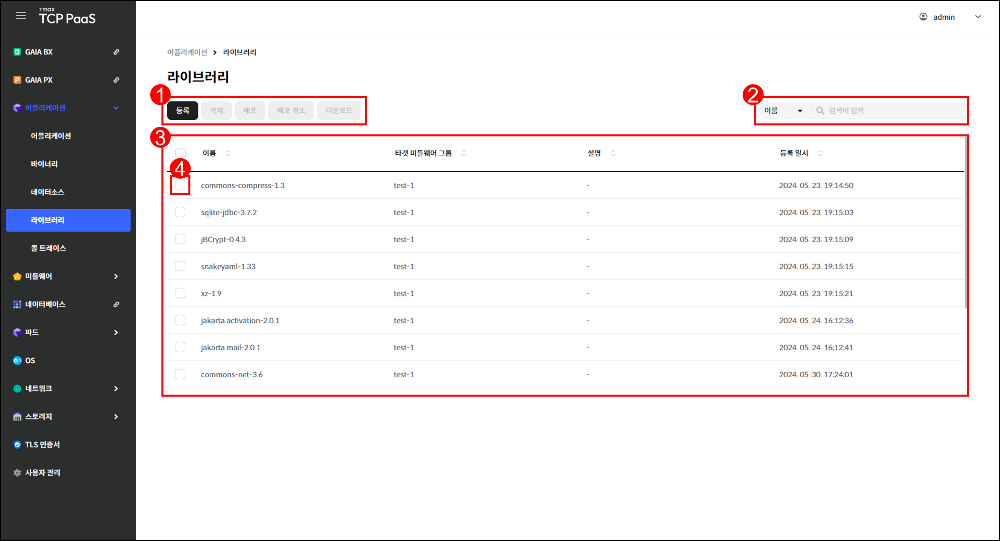
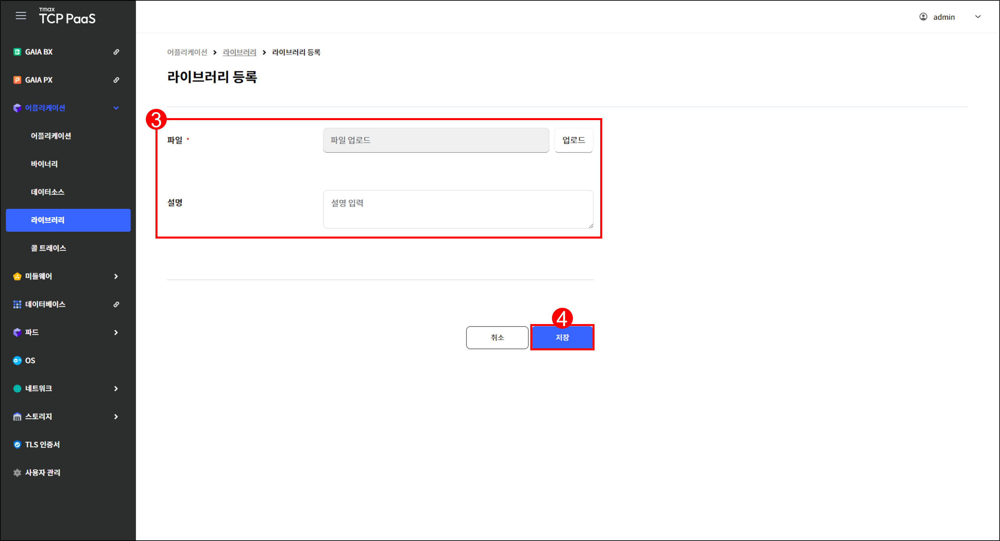
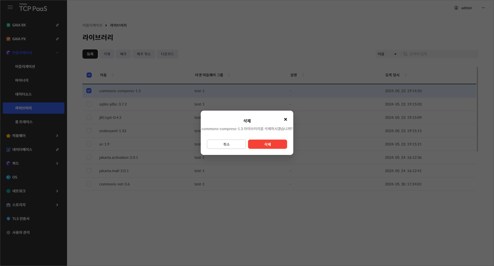
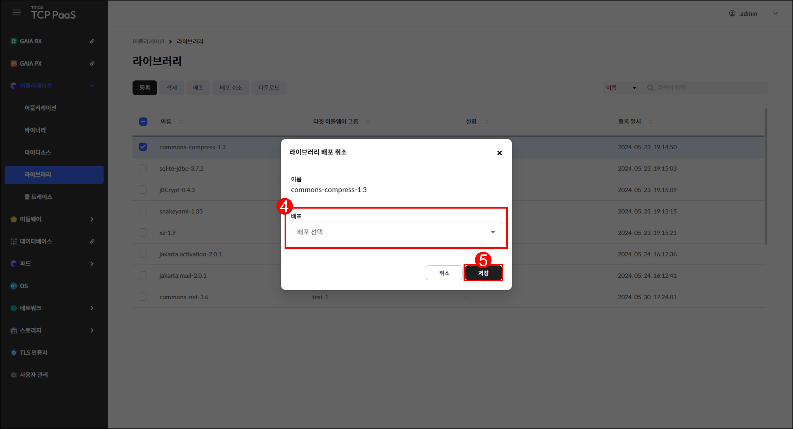

# 1.4 라이브러리

## 라이브러리 화면

메뉴 영역에서 `어플리케이션` > `라이브러리`를 차례로 클릭하여 라이브러리 화면을 확인할 수 있습니다.

<figure><figcaption>
[그림 1.4.1] 라이브러리 화면 구성
</figcaption></figure>

1.  버튼을 클릭하여 다음을 실행할 수 있습니다.

    <table><thead><tr><th width="135">버튼</th><th width="308">기능</th><th>활성화 조건</th></tr></thead><tbody><tr><td><code>등록</code></td><td>라이브러리 등록 페이지로 이동합니다.</td><td>-</td></tr><tr><td><code>삭제</code></td><td>선택한 라이브러리의 삭제 창을 표시 합니다.</td><td>한 개 이상의 라이브러리를 선택 해야 합니다.</td></tr><tr><td><code>배포</code></td><td>선택한 라이브러리의 배포 창을 표시 합니다.</td><td>한 개의 라이브러리를 선택해야  합니다.</td></tr><tr><td><code>배포 취소</code></td><td>선택한 라이브러리의 배포 취소 창을  표시합니다.</td><td>한 개의 라이브러리를 선택해야  합니다.</td></tr><tr><td><code>다운로드</code></td><td>선택한 라이브러리의 파일을 다운로드 합니다.</td><td>한 개의 라이브러리를 선택해야  합니다.</td></tr></tbody></table>
2. 드롭다운 메뉴에서 항목을 선택하고 검색어를 입력하여 라이브러리를 검색할 수 있습니다.
3.  등록한 라이브러리를 조회할 수 있습니다.

    <table><thead><tr><th width="185">항목</th><th>설명</th></tr></thead><tbody><tr><td>이름</td><td>라이브러리의 이름</td></tr><tr><td>타겟 미들웨어 그룹</td><td>라이브러리가 배포된 미들웨어 정보</td></tr><tr><td>설명</td><td>라이브러리에 대한 상세 설명</td></tr><tr><td>등록 일시</td><td>라이브러리가 등록된 시각</td></tr></tbody></table>
4. 체크 박스를 클릭하여 라이브러리를 선택할 수 있습니다.

***

## 라이브러리 등록

<figure><figcaption>
[그림 1.4.2] 라이브러리 등록 버튼
</figcaption></figure>

1. 메뉴 영역에서 `어플리케이션` > `라이브러리`를 클릭합니다.
2. 라이브러리 페이지가 열리면 `등록`을 클릭합니다.

<figure><figcaption>
[그림 1.4.3] 라이브러리 등록 페이지
</figcaption></figure>

3.  등록할 라이브러리의 정보를 입력합니다. 업로드할 파일을 회색 칸 안으로 드래그 앤 드롭하거나 `업로드`를 클릭하여 업로드할 파일을 선택할 수 있습니다.

    <table><thead><tr><th width="116">항목</th><th>설명</th><th>제약 조건</th></tr></thead><tbody><tr><td>파일 <mark style="color:red;"><strong>*</strong></mark></td><td>등록할 라이브러리 파일</td><td>이름 중복 불가</td></tr><tr><td>설명</td><td>라이브러리에 대한 상세 설명</td><td>-</td></tr></tbody></table>
4. 입력을 완료한 후 `저장`을 클릭합니다.

***

## 라이브러리 삭제


**참고**

배포된 라이브러리는 삭제할 수 없습니다.


<figure><figcaption>
[그림 1.4.4] 라이브러리 삭제 창
</figcaption></figure>

1. 메뉴 영역에서 `어플리케이션` > `라이브러리`를 클릭합니다.
2. 삭제할 라이브러리에 체크한 후 `삭제`를 클릭합니다.
3. 삭제 창이 열리면 `삭제`를 클릭합니다.

***

## 라이브러리 배포

<figure><figcaption>
[그림 1.4.5] 라이브러리 배포 버튼
</figcaption></figure>

1. 메뉴 영역에서 `어플리케이션` > `라이브러리`를 클릭합니다.
2. 배포할 라이브러리에 체크합니다.
3. `배포`를 클릭합니다.

<figure><figcaption>
[그림 1.4.6] 라이브러리 배포 창
</figcaption></figure>

4. 라이브러리를 배포할 미들웨어 그룹을 선택합니다.
5. 선택을 완료한 후 `저장`을 클릭합니다.&#x20;

***

## 라이브러리 배포 취소


**주의**

라이브러리 배포를 취소하면 해당 라이브러리를 사용하는 어플리케이션이 정상 작동하지 않을 수 있습니다.


<figure><figcaption>
[그림 1.4.7] 라이브러리 배포 취소 버튼
</figcaption></figure>

1. 메뉴 영역에서 `어플리케이션` > `라이브러리`를 클릭합니다.
2. 배포 취소할 라이브러리에 체크합니다.
3. `배포 취소`를 클릭합니다.

<figure><figcaption>
[그림 1.4.8] 라이브러리 배포 취소 창
</figcaption></figure>

4. 라이브러리 배포를 취소할 미들웨어 그룹을 선택합니다.
5. 선택을 완료한 후 `저장`을 클릭합니다.

***

## 라이브러리 다운로드

<figure><figcaption>
[그림 1.4.9] 라이브러리 다운로드
</figcaption></figure>

1. 메뉴 영역에서 `어플리케이션` > `라이브러리`를 클릭합니다.
2. 다운로드할 라이브러리에 체크합니다.
3. `다운로드`를 클릭합니다.
