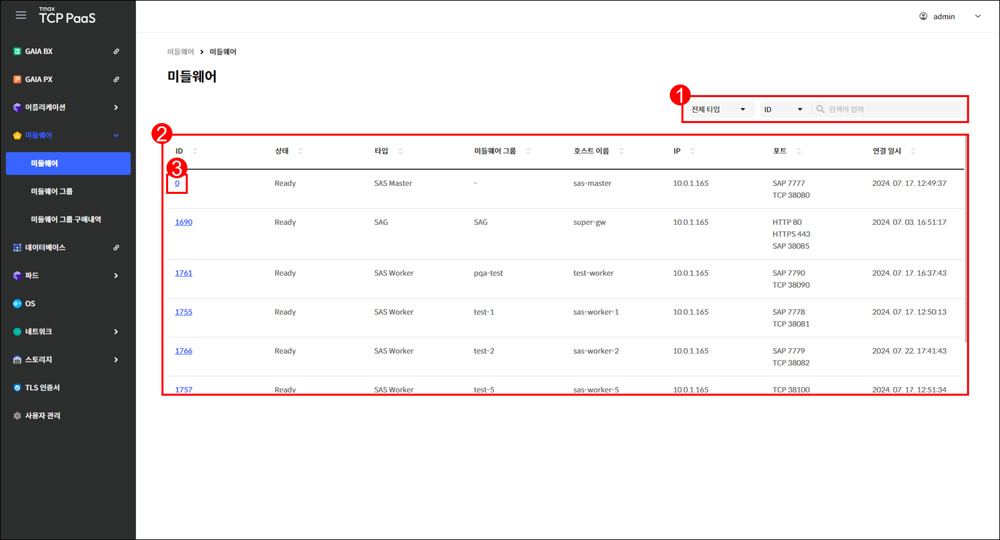
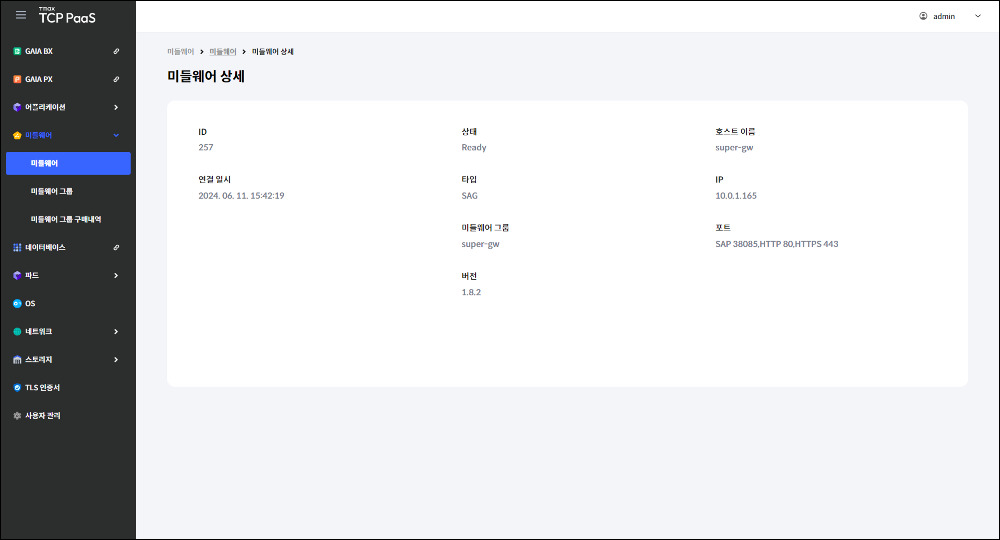
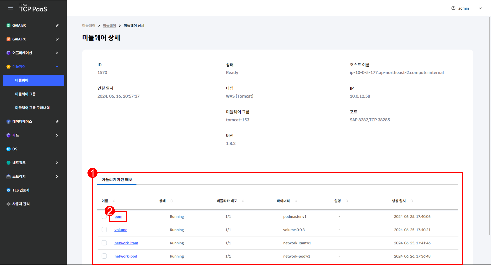
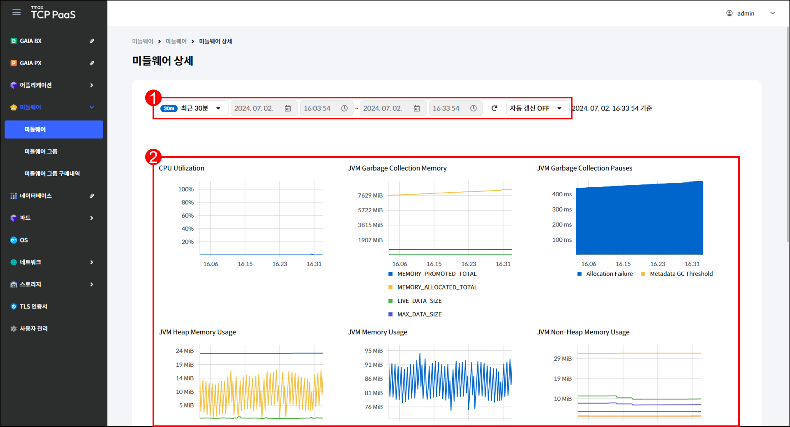

# 2.1 미들웨어

## 미들웨어 화면

메뉴 영역에서 `미들웨어` > `미들웨어`를 차례로 클릭하여 미들웨어 화면을 확인할 수 있습니다.

<figure><figcaption>
[그림 2.1.1] 미들웨어 화면 구성
</figcaption></figure>

1. 드롭다운 메뉴에서 항목을 선택하고 검색어를 입력하여 미들웨어를 검색할 수 있습니다.
2.  미들웨어를 조회할 수 있습니다.&#x20;

    <table><thead><tr><th width="150">항목</th><th>설명</th></tr></thead><tbody><tr><td>ID</td><td>미들웨어 ID</td></tr><tr><td>상태</td><td><code>MiddleWareMaster</code>와의 연결 상태</td></tr><tr><td>타입</td><td>
연결된 미들웨어의 종류
<ul><li><code>SAG</code>: Super App  Gateway</li><li><code>SAS Master</code>: Super App Server Master</li><li><code>SAS Worker</code>: Super App Server Worker</li><li><code>WAS (Tomcat)</code>: Web Application Server (Tomcat)</li><li><code>WAS (Django)</code>: Web Application Server (Django)</li></ul></td></tr><tr><td>미들웨어 그룹</td><td>미들웨어가 속한 그룹</td></tr><tr><td>호스트 이름</td><td>미들웨어가 기동되는 컨테이너의 호스트 이름</td></tr><tr><td>IP</td><td><code>MiddleWareMaster</code>와 연결 시 사용한 IP</td></tr><tr><td>포트</td><td>미들웨어가 사용하는 SAP, TCP, HTTP, HTTPS 포트</td></tr><tr><td>연결 일시</td><td><code>MiddleWareMaster</code>와 연결된 시각</td></tr></tbody></table>
3. 미들웨어의 ID를 클릭하면 해당 미들웨어의 상세 페이지로 이동합니다.

***

## 미들웨어 상세

<figure><figcaption>
[그림 2.1.2] 미들웨어 조회 페이지
</figcaption></figure>

1. 메뉴 영역에서 `미들웨어` > `미들웨어`를 클릭합니다.
2. 상세 정보를 확인할 미들웨어의 ID를 클릭합니다.
3.  미들웨어의 타입에 따라 제공되는 정보가 다릅니다.&#x20;

    * [SAG 타입](2.1-node.md#sag)
    * [WAS (Tomcat) 타입](2.1-node.md#was-tomcat)
    * [SAS Master 타입](2.1-node.md#sas-master)
    *   [SAS Worker 타입](2.1-node.md#sas-worker)

    타입에 관계없이 기본으로 표시되는 항목은 다음과 같습니다.

    <table><thead><tr><th width="149">항목</th><th>설명</th></tr></thead><tbody><tr><td>ID</td><td>미들웨어 ID</td></tr><tr><td>연결 일시</td><td><code>MiddleWareMaster</code>와 연결된 시각</td></tr><tr><td>상태</td><td><code>MiddleWareMaster</code>와의 연결 상태</td></tr><tr><td>타입</td><td>
연결된 미들웨어의 종류
<ul><li><code>SAG</code>: Super App Gateway</li><li><code>SAS Master</code>: Super App Server Master</li><li><code>SAS Worker</code>: Super App Server Worker</li><li><code>WAS (Tomcat)</code>: Web Application Server (Tomcat)</li><li><code>WAS (Django)</code>: Web Application Server (Django)</li></ul></td></tr><tr><td>미들웨어 그룹</td><td>미들웨어가 속한 그룹</td></tr><tr><td>버전</td><td>미들웨어 기동 시 사용된 이미지의 버전</td></tr><tr><td>호스트 이름</td><td>미들웨어가 기동되는 컨테이너의 호스트 이름</td></tr><tr><td>IP</td><td><code>MiddleWareMaster</code>와 연결 시 사용한 IP</td></tr><tr><td>포트</td><td>미들웨어가 사용하는 SAP, TCP, HTTP, HTTPS 포트</td></tr></tbody></table>

### SAG 타입

`SAG` 타입의 경우, 기본 항목만 표시됩니다.

<figure><figcaption>
[그림 2.1.3] <code>SAG</code> 타입 미들웨어 상세 페이지
</figcaption></figure>

### WAS (Tomcat) 타입

<figure><figcaption>
[그림 2.1.4] <code>WAS (Tomcat)</code> 타입 미들웨어 상세 페이지
</figcaption></figure>

1.  `WAS (Tomcat)` 타입의 경우, 어플리케이션 배포 탭에서 미들웨어에 배포된 어플리케이션을 조회할 수 있습니다.

    <table><thead><tr><th width="149">항목</th><th>설명</th></tr></thead><tbody><tr><td>이름</td><td>어플리케이션의 이름</td></tr><tr><td>상태</td><td>
어플리케이션의 상태

(<code>Creating</code>, <code>Running</code>, <code>Updating</code>, <code>Terminating</code>, <code>Warning</code>,  <code>Failed</code>)
</td></tr><tr><td>레플리카 배포</td><td>레플리카 배포 정보 &#x3C;작동 중인 레플리카 수>/&#x3C;전체 레플리카 수></td></tr><tr><td>바이너리</td><td>배포에 사용된 바이너리 정보 &#x3C;바이너리 그룹 이름>:&#x3C;버전></td></tr><tr><td>설명</td><td>어플리케이션에 대한 상세 설명</td></tr><tr><td>생성 일시</td><td>어플리케이션이 생성된 시각</td></tr></tbody></table>
2. 어플리케이션의 이름을 해당 어플리케이션의 상세 페이지로 이동합니다. 어플리케이션 상세 페이지에 관한 설명은 "[1.1 어플리케이션 > 어플리케이션 상세](../1./1.1-application.md#undefined-4)"를 참고하기 바랍니다.

### SAS Master 타입

<figure><figcaption>
[그림 2.1.5] <code>SAS Master</code> 타입 미들웨어 상세 페이지
</figcaption></figure>

1. 필터를 사용하여 특정 시간대의 데이터를 조회할 수 있습니다. 새로 고침 버튼을 클릭하거나 자동 갱신 기능을 사용하여 일정한 시간 간격마다 자동으로 데이터를 갱신할 수 있습니다.
2.  `SAS Master` 타입의 경우, 다음과 같은 리소스 사용 정보를 조회할 수 있습니다.

    <table><thead><tr><th width="312">항목</th><th>설명</th></tr></thead><tbody><tr><td>CPU Utilization</td><td>CPU 사용률</td></tr><tr><td>JVM Garbage Collection Memory</td><td>JVM Garbage Collection Memory 정보</td></tr><tr><td>JVM Garbage Collection Pauses</td><td>Memory 영역이 가득 찼을 때 발생하는 이벤트 정보</td></tr><tr><td>JVM Heap Memory Usage</td><td>JVM Heap Memory 사용량</td></tr><tr><td>JVM Memory Usage</td><td>JVM Memory 사용량</td></tr><tr><td>JVM Non-Heap Memory Usage</td><td>JVM Non-Heap 영역의 Memory 사용량</td></tr></tbody></table>

### SAS Worker 타입

`SAS Worker` 타입의 경우, 어플리케이션 배포 탭과 리소스 사용 정보를 모두 조회할 수 있습니다.
