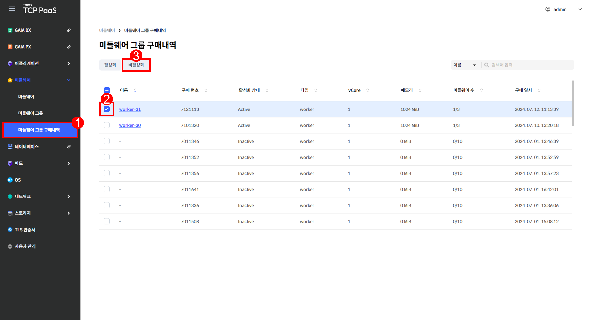

# 2.3 미들웨어 그룹 구매내역

## 미들웨어 그룹 구매내역 화면

메뉴 영역에서 `미들웨어` > `미들웨어 그룹 구매내역`을 차례로 클릭하여 미들웨어 그룹 구매내역 화면을 확인할 수 있습니다.

<figure><figcaption>
[그림 2.3.1] 미들웨어 그룹 구매내역 화면 구성
</figcaption></figure>

1.  버튼을 클릭하여 다음을 실행할 수 있습니다.

    <table><thead><tr><th width="135">버튼</th><th width="302">기능</th><th>활성화 조건</th></tr></thead><tbody><tr><td><code>활성화</code></td><td>미들웨어 그룹 구매내역 활성화  페이지로 이동합니다.</td><td>한 개의 미들웨어 그룹 구매내역을  선택해야 합니다.</td></tr><tr><td><code>비활성화</code></td><td>미들웨어 그룹 구매내역 비활성화  창을 표시합니다.</td><td>한 개의 미들웨어 그룹 구매내역을  선택해야 합니다.</td></tr></tbody></table>
2. 드롭다운 메뉴에서 항목을 선택하고 검색어를 입력하여 미들웨어 그룹 구매내역을 검색할 수 있습니다.
3.  미들웨어 그룹 구매내역을 조회할 수 있습니다.&#x20;

    <table><thead><tr><th width="135">항목</th><th>설명</th></tr></thead><tbody><tr><td>이름</td><td>미들웨어 그룹 구매내역의 이름</td></tr><tr><td>구매 번호</td><td>미들웨어 그룹 구매 번호</td></tr><tr><td>활성화 상태</td><td>미들웨어 그룹 구매내역의 활성화 상태</td></tr><tr><td>타입</td><td>
연결된 미들웨어의 종류
<ul><li><code>worker</code></li><li><code>sasgateway</code></li></ul></td></tr><tr><td>vCore</td><td>한 대의 가상 서버에 연결되는 CPU의 코어 수</td></tr><tr><td>메모리</td><td>메모리 용량</td></tr><tr><td>미들웨어 수</td><td>미들웨어 그룹에 속한 미들웨어의 수</td></tr><tr><td>구매 일시</td><td>미들웨어 그룹을 구매한 시각</td></tr></tbody></table>
4. 체크 박스를 클릭하여 미들웨어 그룹 구매내역을 선택할 수 있습니다.
5. 구매내역의 이름을 클릭하면 해당 구매내역의 상세 페이지로 이동합니다.

***

## 미들웨어 그룹 구매내역 활성화

<figure><figcaption>
[그림 2.3.2] 미들웨어 그룹 구매내역 활성화 버튼
</figcaption></figure>

1. 메뉴 영역에서 `미들웨어` > `미들웨어 그룹 구매내역`을 클릭합니다.
2. 활성화할 구매내역에 체크합니다.
3. `활성화`를 클릭합니다.

<figure><figcaption>
[그림 2.3.3] 미들웨어 그룹 구매내역 활성화 페이지
</figcaption></figure>

4. 활성화할 미들웨어 그룹 구매내역의 정보를 입력합니다.

<table><thead><tr><th width="156">항목</th><th>설명</th></tr></thead><tbody><tr><td>이름</td><td>미들웨어 그룹 구매내역의 이름</td></tr><tr><td>메모리 <mark style="color:red;">*</mark></td><td>메모리 용량</td></tr><tr><td>미들웨어 수</td><td>미들웨어 그룹에 속한 미들웨어의 수</td></tr><tr><td>환경 변수 <mark style="color:red;">*</mark></td><td>설정할 환경 변수(키, 값)</td></tr></tbody></table>

5. 입력을 완료한 후 `저장`을 클릭합니다.

***

## 미들웨어 그룹 구매내역 비활성화

<figure><figcaption>
[그림 2.3.4] 미들웨어 그룹 구매내역 비활성화 버튼
</figcaption></figure>

1. 메뉴 영역에서 `미들웨어` > `미들웨어 그룹 구매내역`을 클릭합니다.
2. 비활성화할 구매내역에 체크합니다.
3. `비활성화`를 클릭합니다.
4. 비활성화 창이 열리면 `비활성화`를 클릭합니다.
