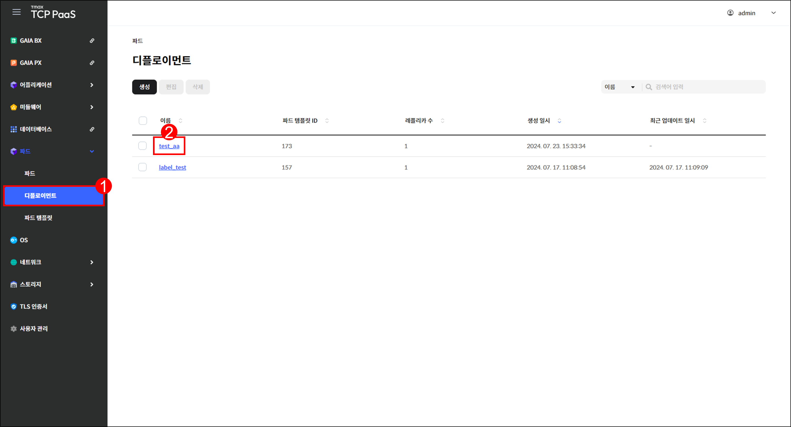
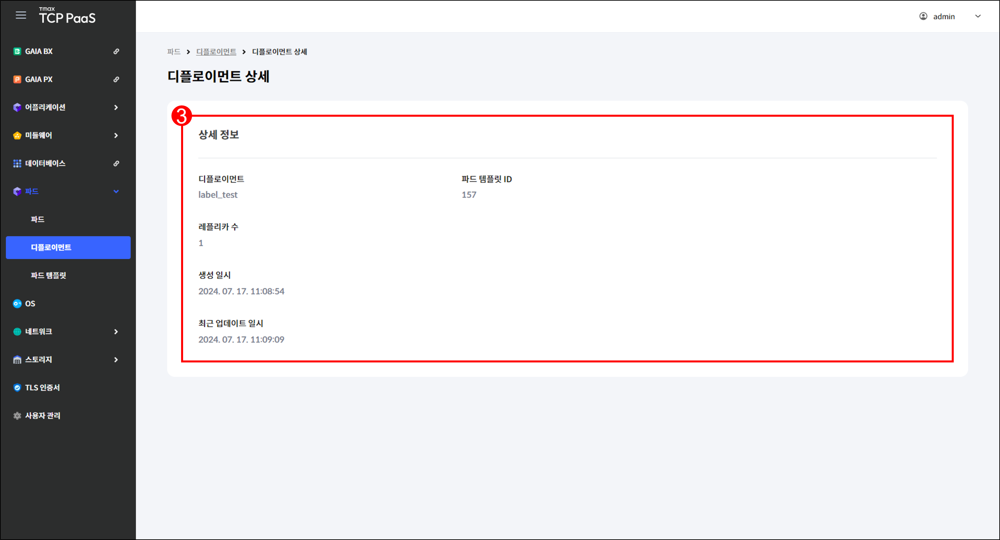

# 3.2 디플로이먼트

## 디플로이먼트 화면

메뉴 영역에서 `파드` > `디플로이먼트`를 차례로 클릭하여 디플로이먼트 화면을 확인할 수 있습니다.

<figure><figcaption>
[그림 3.2.1] 디플로이먼트 화면 구성
</figcaption></figure>

1.  버튼을 클릭하여 다음을 실행할 수 있습니다.

    <table><thead><tr><th width="104">버튼</th><th width="326">기능</th><th>활성화 조건</th></tr></thead><tbody><tr><td><code>생성</code></td><td>디플로이먼트 생성 페이지로 이동합니다.</td><td>-</td></tr><tr><td><code>편집</code></td><td>선택한 디플로이먼트의 편집 페이지로  이동합니다.</td><td>한 개의 디플로이먼트를 선택해야  합니다.</td></tr><tr><td><code>삭제</code></td><td>선택한 디플로이먼트의 삭제 창을 표시 합니다.</td><td>한 개 이상의 디플로이먼트를 선택 해야 합니다.</td></tr></tbody></table>
2. 드롭다운 메뉴에서 항목을 선택하고 검색어를 입력하여 디플로이먼트를 검색할 수 있습니다.
3.  디플로이먼트를 조회할 수 있습니다.&#x20;

    <table><thead><tr><th width="192">항목</th><th>설명</th></tr></thead><tbody><tr><td>이름</td><td>디플로이먼트의 이름</td></tr><tr><td>파드 템플릿 ID</td><td>파드 생성에 사용되는 파드 템플릿의 ID</td></tr><tr><td>레플리카 수</td><td>기동할 파드 수</td></tr><tr><td>생성 일시</td><td>디플로이먼트가 생성된 시각</td></tr><tr><td>최근 업데이트 일시</td><td>디플로이먼트가 마지막으로 편집된 시각</td></tr></tbody></table>
4. 체크 박스를 클릭하여 디플로이먼트를 선택할 수 있습니다.
5. 디플로이먼트의 이름을 클릭하면 해당 디플로이먼트의 상세 페이지로 이동합니다.

***

## 디플로이먼트 생성

<figure><figcaption>
[그림 3.2.2] 디플로이먼트 생성 버튼
</figcaption></figure>

1. 메뉴 영역에서 `파드` > `디플로이먼트`를 클릭합니다.
2. 디플로이먼트 페이지가 열리면 `생성`을 클릭합니다.

<figure><figcaption>
[그림 3.2.3] 디플로이먼트 생성 페이지
</figcaption></figure>

3.  생성할 디플로이먼트의 정보를 입력합니다.

    <table><thead><tr><th width="170">항목</th><th>설명</th></tr></thead><tbody><tr><td>이름 <mark style="color:red;">*</mark></td><td>디플로이먼트의 이름</td></tr><tr><td>파드 템플릿 <mark style="color:red;">*</mark></td><td>파드 생성에 사용할 파드 템플릿</td></tr><tr><td>레플리카 수 <mark style="color:red;">*</mark></td><td>기동할 파드 수</td></tr><tr><td>네임스페이스 <mark style="color:red;">*</mark></td><td>파드를 생성할 네임스페이스의 이름</td></tr></tbody></table>
4. 입력을 완료한 후 `저장`을 클릭합니다.

***

## 디플로이먼트 편집

<figure><figcaption>
[그림 3.2.4] 디플로이먼트 편집 버튼
</figcaption></figure>

1. 메뉴 영역에서 `파드` > `디플로이먼트`를 클릭합니다.
2. 편집할 디플로이먼트에 체크합니다.
3. `편집`을 클릭합니다.

<figure><figcaption>
[그림 3.2.5] 디플로이먼트 편집 페이지
</figcaption></figure>

4.  다음 항목을 편집할 수 있습니다.&#x20;

    <table><thead><tr><th width="173">항목</th><th>설명</th></tr></thead><tbody><tr><td>네임스페이스 <mark style="color:red;">*</mark></td><td>파드를 생성할 네임스페이스의 이름</td></tr><tr><td>파드 템플릿 <mark style="color:red;">*</mark></td><td>파드 생성에 사용할 파드 템플릿</td></tr><tr><td>레플리카 수 <mark style="color:red;">*</mark></td><td>기동할 파드 수</td></tr></tbody></table>
5. 편집을 완료한 후 `저장`을 클릭합니다.

***

## 디플로이먼트 삭제

<figure><figcaption>
[그림 3.2.6] 디플로이먼트 삭제 창
</figcaption></figure>

1. 메뉴 영역에서 `파드` > `디플로이먼트`를 클릭합니다.
2. 삭제할 디플로이먼트에 체크한 후 `삭제`를 클릭합니다.
3. 삭제 창이 열리면 `삭제`를 클릭합니다.

***

## 디플로이먼트 상세

<figure><figcaption>
[그림 3.2.7] 디플로이먼트 조회 페이지
</figcaption></figure>

1. 메뉴 영역에서 `파드` > `디플로이먼트`를 클릭합니다.
2. 상세 정보를 확인할 디플로이먼트의 이름을 클릭합니다.

<figure><figcaption>
[그림 3.2.8] 디플로이먼트 상세 페이지
</figcaption></figure>

3.  디플로이먼트의 상세 정보를 조회할 수 있습니다.&#x20;

    <table><thead><tr><th width="193">항목</th><th>설명</th></tr></thead><tbody><tr><td>디플로이먼트</td><td>디플로이먼트의 이름</td></tr><tr><td>파드 템플릿 ID</td><td>파드 생성에 사용되는 파드 템플릿의 ID</td></tr><tr><td>레플리카 수</td><td>기동할 파드 수</td></tr><tr><td>생성 일시</td><td>디플로이먼트가 생성된 시각</td></tr><tr><td>최근 업데이트 일시</td><td>디플로이먼트가 마지막으로 편집된 시각</td></tr></tbody></table>
