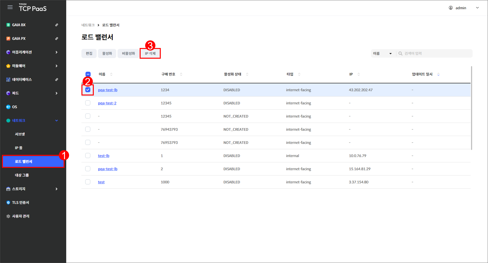
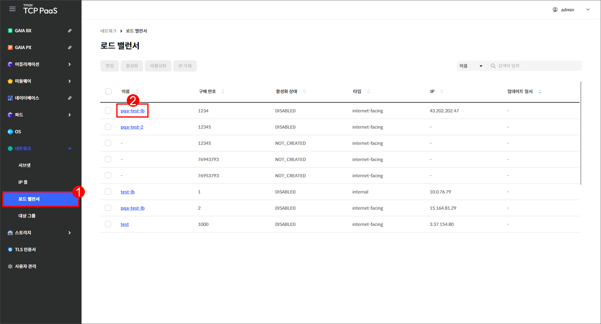

# 5.3 로드 밸런서

## 로드 밸런서 화면

메뉴 영역에서 `네트워크` > `로드 밸런서`를 차례로 클릭하여 로드 밸런서 화면을 확인할 수 있습니다.

<figure><figcaption>
[그림 5.3.1] 로드 밸런서 화면 구성
</figcaption></figure>

1.  버튼을 클릭하여 다음을 실행할 수 있습니다.

    <table><thead><tr><th width="148">버튼</th><th width="308">기능</th><th>활성화 조건</th></tr></thead><tbody><tr><td><code>편집</code></td><td>선택한 로드 밸런서의 편집 페이지로 이동합니다.</td><td>한 개의 로드 밸런서를 선택해야  합니다.</td></tr><tr><td><code>활성화</code></td><td>선택한 로드 밸런서의 활성화 페이지로  이동합니다.</td><td>한 개의 로드 밸런서를 선택해야  합니다.</td></tr><tr><td><code>비활성화</code></td><td>선택한 로드 밸런서를 비활성화합니다.</td><td>한 개의 로드 밸런서를 선택해야  합니다.</td></tr><tr><td><code>IP 삭제</code></td><td>선택한 로드 밸런서의 IP를 삭제합니다.</td><td>
한 개의 로드 밸런서를 선택해야 

합니다.
</td></tr></tbody></table>
2. 드롭다운 메뉴에서 항목을 선택하고 검색어를 입력하여 로드 밸런서를 검색할 수 있습니다.
3.  로드 밸런서를 조회할 수 있습니다.&#x20;

    <table><thead><tr><th width="151">항목</th><th>설명</th></tr></thead><tbody><tr><td>이름</td><td>로드 밸런서의 이름</td></tr><tr><td>구매 번호</td><td>로드 밸런서의 구매 번호</td></tr><tr><td>활성화 상태</td><td>
로드 밸런서의 활성화 상태
<ul><li><code>NOT_CREATED</code> : 구매 정보만 존재하는 상태</li><li><code>ENABLED</code> : 로드 밸런서가 활성화되어 LB IP, ARN, DNS 정보가  존재하는 상태</li><li><code>DISABLED</code>: 로드 밸런서가 비활성화되어 LB IP, ARN, DNS 정보가  없는 상태</li></ul></td></tr><tr><td>타입</td><td>
로드 밸런서의 스킴
<ul><li><code>internet-facing</code>: 인터넷을 통해서 접근 가능한 로드 밸런서</li><li><code>internal</code>: 내부 네크워크 또는 VPC를 통해서 접근 가능한 로드 밸런서</li></ul></td></tr><tr><td>IP</td><td>로드 밸런서의 IP</td></tr><tr><td>업데이트 일시</td><td>로드 밸런서가 마지막으로 편집된 시각</td></tr></tbody></table>
4. 체크 박스를 클릭하여 로드 밸런서를 선택할 수 있습니다.
5. 로드 밸런서의 이름을 클릭하면 해당 로드 밸런서의 상세 페이지로 이동합니다.

***

## 로드 밸런서 편집

<figure><figcaption>
[그림 5.3.2] 로드 밸런서 편집 버튼
</figcaption></figure>

1. 메뉴 영역에서 `네트워크` > `로드 밸런서`를 클릭합니다.
2. 편집할 로드 밸런서에 체크합니다.
3. `편집`을 클릭합니다.

\[그림 5.3.3] 로드 밸런서 편집 페이지

4.  다음 항목을 편집할 수 있습니다.

    <table><thead><tr><th width="177">항목</th><th>설명</th></tr></thead><tbody><tr><td>이름 <mark style="color:red;"><strong>*</strong></mark></td><td>로드 밸런서의 이름</td></tr><tr><td>타입 <mark style="color:red;"><strong>*</strong></mark></td><td>
로드 밸런서의 타입
<ul><li><code>network</code> : 고성능 및 대규모 지원을 대상으로 기능 제공</li><li><code>application</code> : 어플리케이션 아키텍쳐를 대상으로 기능 제공</li><li><code>gateway</code> : 보안 및 정책 제어를 대상으로 기능 제공</li></ul></td></tr><tr><td>서브넷 <mark style="color:red;"><strong>*</strong></mark></td><td>로드 밸런서가 사용할 서브넷</td></tr><tr><td>IP <mark style="color:red;"><strong>*</strong></mark></td><td>
로드 밸런서의 IP 할당 방법
<ul><li><code>자동 할당</code> : 서브넷 내 IP 주소로 자동 할당</li><li><code>직접 입력</code> : 사용할 IP 주소를 직접 입력하여 할당</li></ul></td></tr><tr><td>보안 그룹</td><td>로드 밸런서가 사용할 보안 그룹</td></tr><tr><td>리스너 > 프로토콜</td><td>로드 밸런서 리스너의 프로토콜</td></tr><tr><td>리스너 > 포트</td><td>로드 밸런서 리스너의 포트</td></tr><tr><td>대상 그룹</td><td>로드 밸런서에 결합할 대상 그룹</td></tr></tbody></table>
5. 편집을 완료한 후 `저장`을 클릭합니다.

***

## 로드 밸런서 활성화

<figure><figcaption>
[그림 5.3.4] 로드 밸런서 활성화 버튼
</figcaption></figure>

1. 메뉴 영역에서 `네트워크` > `로드 밸런서`를 클릭합니다.
2. 활성화할 로드 밸런서에 체크합니다.
3. `활성화`를 클릭합니다.

<figure><figcaption>
[그림 5.3.5] 로드 밸런서 활성화 페이지
</figcaption></figure>

4.  활성화할 로드 밸런서의 정보를 입력합니다.&#x20;

    <table><thead><tr><th width="181">항목</th><th>설명</th></tr></thead><tbody><tr><td>이름 <mark style="color:red;"><strong>*</strong></mark></td><td>로드 밸런서의 이름</td></tr><tr><td>타입 <mark style="color:red;"><strong>*</strong></mark></td><td>
로드 밸런서의 타입
<ul><li><code>network</code> : 고성능 및 대규모 지원을 대상으로 기능 제공</li><li><code>application</code> : 어플리케이션 아키텍쳐를 대상으로 기능 제공</li><li><code>gateway</code> : 보안 및 정책 제어를 대상으로 기능 제공</li></ul></td></tr><tr><td>서브넷 <mark style="color:red;"><strong>*</strong></mark></td><td>로드 밸런서가 사용할 서브넷</td></tr><tr><td>IP <mark style="color:red;"><strong>*</strong></mark></td><td>
로드 밸런서의 IP 할당 방법
<ul><li><code>자동 할당</code> : 서브넷 내 IP 주소로 자동 할당</li><li><code>직접 입력</code> : 사용할 IP 주소를 직접 입력하여 할당</li></ul></td></tr><tr><td>보안 그룹</td><td>로드 밸런서가 사용할 보안 그룹</td></tr><tr><td>리스너 > 프로토콜</td><td>로드 밸런서 리스너의 프로토콜</td></tr><tr><td>리스너 > 포트</td><td>로드 밸런서 리스너의 포트</td></tr><tr><td>대상 그룹</td><td>로드 밸런서에 결합시킬 대상 그룹</td></tr></tbody></table>
5. 입력을 완료한 후 `저장`을 클릭합니다.

***

## 로드 밸런서 비활성화

<figure><figcaption>
[그림 5.3.6] 로드 밸런서 비활성화 버튼
</figcaption></figure>

1. 메뉴 영역에서 `네트워크` > `로드 밸런서`를 클릭합니다.
2. 비활성화할 로드 밸런서에 체크합니다.
3. `비활성화`를 클릭합니다.

***

## 로드 밸런서 IP 삭제


**참고**

로드 밸런서의 IP 값이 있는 경우에만 `IP 삭제` 버튼이 활성화됩니다.


<figure><figcaption>
[그림 5.3.7] 로드 밸런서 IP 삭제 버튼
</figcaption></figure>

1. 메뉴 영역에서 `네트워크` > `로드 밸런서`를 클릭합니다.
2. IP를 삭제할 로드 밸런서에 체크합니다.
3. `IP 삭제`를 클릭합니다.

***

## 로드 밸런서 상세

<figure><figcaption>
[그림 5.3.8] 로드 밸런서 조회 페이지
</figcaption></figure>

1. 메뉴 영역에서 `네트워크` > `로드 밸런서`를 클릭합니다.
2. 상세 정보를 확인할 로드 밸런서의 이름을 클릭합니다.

<figure><figcaption>
[그림 5.3.9] 로드 밸런서 상세 페이지
</figcaption></figure>

3.  버튼을 클릭하여 다음을 실행할 수 있습니다.

    <table><thead><tr><th width="178">버튼</th><th>기능</th></tr></thead><tbody><tr><td><code>액션</code> > <code>편집</code></td><td>해당 로드 밸런서의 편집 페이지를 표시합니다.</td></tr><tr><td><code>액션</code> > <code>비활성화</code></td><td>해당 로드 밸런서를 비활성화합니다.</td></tr></tbody></table>
4.  로드 밸런서의 상세 정보를 조회할 수 있습니다.&#x20;

    <table><thead><tr><th width="154">항목</th><th>설명</th></tr></thead><tbody><tr><td>이름</td><td>로드 밸런서의 이름</td></tr><tr><td>활성화 상태</td><td>
로드 밸런서의 활성화 상태
<ul><li><code>NOT_CREATED</code> : 구매 정보만 존재하는 상태</li><li><code>ENABLED</code> : 로드 밸런서가 활성화되어 LB IP, ARN, DNS 정보가  존재하는 상태</li><li><code>DISABLED</code>: 로드 밸런서가 비활성화되어 LB IP, ARN, DNS 정보가  없는 상태</li></ul></td></tr><tr><td>서브넷</td><td>로드 밸런서가 사용 중인 서브넷 ID</td></tr><tr><td>생성 일시</td><td>로드 밸런서가 생성된 시각</td></tr><tr><td>타입</td><td>
로드 밸런서의 스킴
<ul><li><code>internet-facing</code>: 인터넷을 통해서 접근 가능한 로드 밸런서</li><li><code>internal</code>: 내부 네크워크 또는 VPC를 통해서 접근 가능한 로드 밸런서</li></ul></td></tr><tr><td>IP</td><td>로드 밸런서의 IP</td></tr><tr><td>보안 그룹</td><td>로드 밸런서가 사용 중인 보안 그룹 ID</td></tr></tbody></table>
5.  리스너 및 라우팅 탭에서는 로드 밸런서 생성 시 입력한 리스너와 대상 그룹에 대한 정보를 조회할 수 있습니다.

    <table><thead><tr><th width="150">항목</th><th>설명</th></tr></thead><tbody><tr><td>리스너</td><td>로드 밸런서의 리스너 ID</td></tr><tr><td>대상 그룹</td><td>로드 밸런서에 결합된 대상 그룹의 이름</td></tr></tbody></table>
