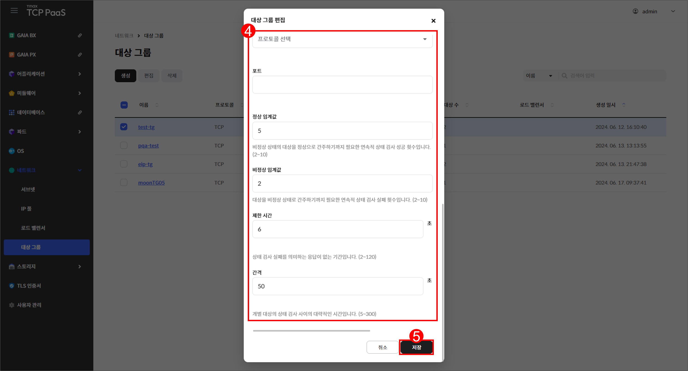
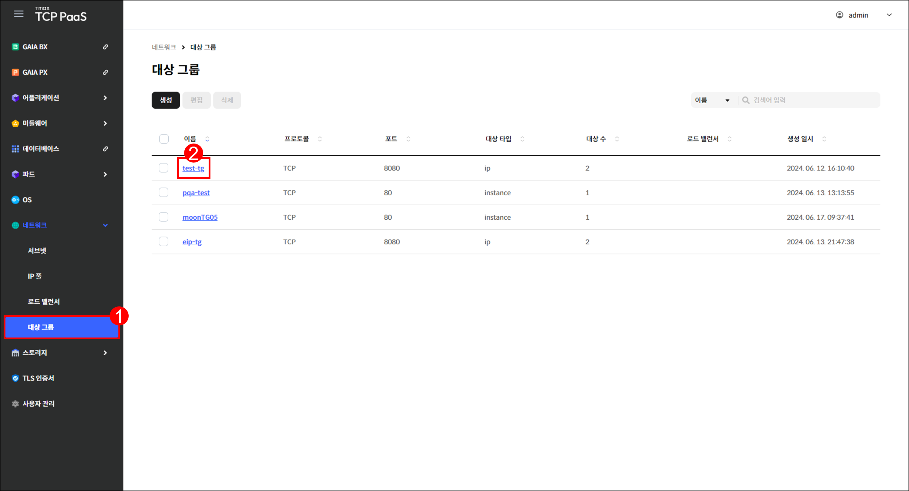
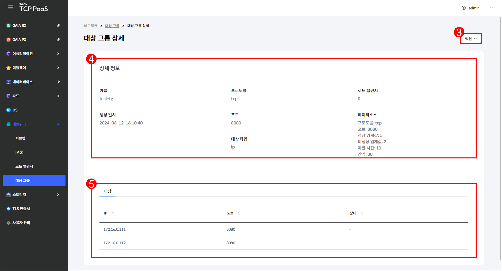

# 5.4 대상 그룹

## 대상 그룹 화면

메뉴 영역에서 `네트워크` > `대상 그룹`을 차례로 클릭하여 대상 그룹 화면을 확인할 수 있습니다.

<figure><figcaption>
[그림 5.4.1] 대상 그룹 화면 구성
</figcaption></figure>

1.  버튼을 클릭하여 다음을 실행할 수 있습니다.

    <table><thead><tr><th width="112">버튼</th><th width="353">기능</th><th>활성화 조건</th></tr></thead><tbody><tr><td><code>생성</code></td><td>대상 그룹 생성 페이지로 이동합니다.</td><td>-</td></tr><tr><td><code>편집</code></td><td>선택한 대상 그룹의 편집 창을 표시합니다.</td><td>한 개의 대상 그룹을 선택해야  합니다.</td></tr><tr><td><code>삭제</code></td><td>선택한 대상 그룹의 삭제 창을 표시합니다.</td><td>한 개의 대상 그룹을 선택해야  합니다.</td></tr></tbody></table>
2. 드롭다운 메뉴에서 항목을 선택하고 검색어를 입력하여 대상 그룹을 검색할 수 있습니다.
3.  생성한 대상 그룹을 조회할 수 있습니다.&#x20;

    <table><thead><tr><th width="134">항목</th><th>설명</th></tr></thead><tbody><tr><td>이름</td><td>대상 그룹의 이름</td></tr><tr><td>프로토콜</td><td>대상 그룹의 프로토콜</td></tr><tr><td>포트</td><td>대상 그룹의 포트 번호</td></tr><tr><td>대상 타입</td><td>대상 그룹의 타입</td></tr><tr><td>대상 수</td><td>대상 그룹에 추가된 대상 수</td></tr><tr><td>로드 밸런서</td><td>대상 그룹에 결합된 로드 밸런서의 이름</td></tr><tr><td>생성 일시</td><td>대상 그룹이 생성된 시각</td></tr></tbody></table>
4. 체크 박스를 클릭하여 대상 그룹을 선택할 수 있습니다.
5. 대상 그룹의 이름을 클릭하면 해당 대상 그룹의 상세 페이지로 이동합니다.

***

## 대상 그룹 생성

<figure><figcaption>
[그림 5.4.2] 대상 그룹 생성 버튼
</figcaption></figure>

1. 메뉴 영역에서 `네트워크` > `대상 그룹`을 클릭합니다.
2. 대상 그룹 페이지가 열리면 `생성`을 클릭합니다.

<figure><figcaption>
[그림 5.4.3] 대상 그룹 생성 페이지
</figcaption></figure>

3.  생성할 대상 그룹의 정보를 입력합니다.&#x20;

    <table><thead><tr><th width="166">항목</th><th>설명</th></tr></thead><tbody><tr><td>이름 <mark style="color:red;"><strong>*</strong></mark></td><td>대상 그룹의 이름</td></tr><tr><td>프로토콜 <mark style="color:red;"><strong>*</strong></mark></td><td>대상 그룹의 프로토콜(<code>TCP</code>, <code>UDP</code>, <code>TLS</code>)</td></tr><tr><td>포트 <mark style="color:red;"><strong>*</strong></mark></td><td>대상 그룹의 포트(1~65535)</td></tr><tr><td>대상 <mark style="color:red;"><strong>*</strong></mark></td><td>
대상 그룹에 추가할 대상
<ul><li><code>IP 주소</code>: IP 주소와 포트 번호로 대상 추가</li><li><code>OS 인스턴스</code>: 계정 내부 OS 인스턴스로 대상 추가</li></ul></td></tr><tr><td>경로</td><td>대상 그룹의 상태 검사 경로</td></tr><tr><td>프로토콜 <mark style="color:red;"><strong>*</strong></mark></td><td>대상 그룹의 상태 검사 프로토콜(<code>TCP</code>, <code>HTTP</code>, <code>HTTPS</code>)</td></tr><tr><td>포트 <mark style="color:red;"><strong>*</strong></mark></td><td>대상 그룹의 상태 검사 포트(1~65535)</td></tr><tr><td>정상 임계값 <mark style="color:red;"><strong>*</strong></mark></td><td>비정상 상태의 대상을 정상으로 간주하기까지 필요한 연속적 상태 검사  성공 횟수(2~10)</td></tr><tr><td>비정상 임계값 <mark style="color:red;"><strong>*</strong></mark></td><td>대상을 비정상 상태로 간주하기까지 필요한 연속적 상태 검사 실패 횟수 (2~10)</td></tr><tr><td>제한 시간 <mark style="color:red;"><strong>*</strong></mark></td><td>상태 검사 실패를 의미하는 응답이 없는 기간(2~120)(단위: 초)</td></tr><tr><td>간격 <mark style="color:red;"><strong>*</strong></mark></td><td>개별 대상의 상태 검사 사이의 대략적인 시간(5~300)(단위: 초)</td></tr></tbody></table>
4. 입력을 완료한 후 `저장`을 클릭합니다.

***

## 대상 그룹 편집

<figure><figcaption>
[그림 5.4.5] 대상 그룹 편집 버튼
</figcaption></figure>

1. 메뉴 영역에서 `네트워크` > `대상 그룹`을 클릭합니다.
2. 편집할 대상 그룹에 체크합니다.
3. `편집`을 클릭합니다.

<figure><figcaption>
[그림 5.4.6] 대상 그룹 편집 창
</figcaption></figure>

4.  다음 항목을 편집할 수 있습니다.

    <table><thead><tr><th width="166">항목</th><th>설명</th></tr></thead><tbody><tr><td>이름 <mark style="color:red;"><strong>*</strong></mark></td><td>대상 그룹의 이름</td></tr><tr><td>프로토콜 <mark style="color:red;"><strong>*</strong></mark></td><td>대상 그룹의 프로토콜(<code>TCP</code>, <code>UDP</code>, <code>TLS</code>)</td></tr><tr><td>포트 <mark style="color:red;"><strong>*</strong></mark></td><td>대상 그룹의 포트(1~65535)</td></tr><tr><td>대상 <mark style="color:red;"><strong>*</strong></mark></td><td>
대상 그룹에 추가할 대상
<ul><li><code>IP 주소</code>: IP 주소와 포트 번호로 대상 추가</li><li><code>OS 인스턴스</code>: 계정 내부 OS 인스턴스로 대상 추가</li></ul></td></tr><tr><td>경로</td><td>대상 그룹의 상태 검사 경로</td></tr><tr><td>프로토콜 <mark style="color:red;"><strong>*</strong></mark></td><td>대상 그룹의 상태 검사 프로토콜(<code>TCP</code>, <code>HTTP</code>, <code>HTTPS</code>)</td></tr><tr><td>포트 <mark style="color:red;"><strong>*</strong></mark></td><td>대상 그룹의 상태 검사 포트(1~65535)</td></tr><tr><td>정상 임계값 <mark style="color:red;"><strong>*</strong></mark></td><td>비정상 상태의 대상을 정상으로 간주하기까지 필요한 연속적 상태 검사  성공 횟수(2~10)</td></tr><tr><td>비정상 임계값 <mark style="color:red;"><strong>*</strong></mark></td><td>대상을 비정상 상태로 간주하기까지 필요한 연속적 상태 검사 실패 횟수 (2~10)</td></tr><tr><td>제한 시간 <mark style="color:red;"><strong>*</strong></mark></td><td>상태 검사 실패를 의미하는 응답이 없는 기간(2~120)(단위: 초)</td></tr><tr><td>간격 <mark style="color:red;"><strong>*</strong></mark></td><td>개별 대상의 상태 검사 사이의 대략적인 시간(5~300)(단위: 초)</td></tr></tbody></table>
5. 편집을 완료한 후 `저장`을 클릭합니다.

***

## 대상 그룹 삭제


**참고**

사용 중인 대상 그룹은 삭제할 수 없습니다.


<figure><figcaption>
[그림 5.4.7] 대상 그룹 삭제 창
</figcaption></figure>

1. 메뉴 영역에서 `네트워크` > `대상 그룹`을 클릭합니다.
2. 삭제할 대상 그룹에 체크한 후 `삭제`를 클릭합니다.
3. 삭제 창이 열리면 `삭제`를 클릭합니다.

***

## 대상 그룹 상세

<figure><figcaption>
[그림 5.4.8] 대상 그룹 조회 페이지
</figcaption></figure>

1. 메뉴 영역에서 `네트워크` > `대상 그룹`을 클릭합니다.
2. 상세 정보를 확인할 대상 그룹의 이름을 클릭합니다.

<figure><figcaption>
[그림 5.4.9] 대상 그룹 상세 페이지
</figcaption></figure>

3. `액션` > `삭제`를 클릭하면 해당 대상 그룹의 삭제 창이 표시됩니다.
4.  대상 그룹의 상세 정보를 조회할 수 있습니다.&#x20;

    <table><thead><tr><th width="134">항목</th><th>설명</th></tr></thead><tbody><tr><td>이름</td><td>대상 그룹의 이름</td></tr><tr><td>프로토콜</td><td>대상 그룹의 프로토콜(<code>TCP</code>, <code>UDP</code>, <code>TLS</code>)</td></tr><tr><td>로드 밸런서</td><td>결합된 로드 밸런서의 ID</td></tr><tr><td>생성 일시</td><td>대상 그룹이 생성된 시각</td></tr><tr><td>포트</td><td>대상 그룹의 포트(1~65535)</td></tr><tr><td>데이터소스</td><td>
대상 그룹에 적용된 데이터소스
<ul><li>포로토콜: 대상 그룹의 상태 검사 프로토콜</li><li>포트: 대상 그룹의 상태 검사 포트(1~65535)</li><li>정상 임계값: 비정상 상태의 대상을 정상으로 간주하기까지 필요한 연속적  상태 검사 성공 횟수(2~10)</li><li>비정상 임계값: 대상을 비정상 상태로 간주하기까지 필요한 연속적 상태  검사 실패 횟수(2~10)</li><li>제한 시간: 상태 검사 실패를 의미하는 응답이 없는 기간(2~120)(단위: 초)</li><li>간격: 개별 대상의 상태 검사 사이의 대략적인 시간(5~300)(단위: 초)</li></ul></td></tr><tr><td>대상 타입</td><td>
대상 그룹의 대상 타입
<ul><li><code>ip</code>: 대상 그룹에 ip주소와 포트 번호로 추가된 대상 타입</li><li><code>instance</code>: 대상 그룹에 계정 내부 OS 인스턴스로 추가된 대상 타입</li></ul></td></tr></tbody></table>
5.  대상 탭에서는 대상 그룹의 대상에 대한 정보를 조회할 수 있습니다.&#x20;

    <table><thead><tr><th width="138">항목</th><th>설명</th></tr></thead><tbody><tr><td>IP</td><td>대상 그룹에 추가된 대상의 IP</td></tr><tr><td>포트</td><td>대상 그룹에 추가된 대상의 포트 번호(1~65535)</td></tr><tr><td>상태</td><td>
대상 그룹에 추가된 대상의 상태
<ul><li><code>Unbind</code>: 로드 밸런서와 결합되지 않은 상태</li><li><code>Initial</code>: 로드 밸런서와 결합된 후 상태 검사 중인 상태</li><li><code>Healthy</code>: 대상의 IP와 포트가 정상인 상태</li><li><code>Unhealthy</code>: 대상이 비정상인 상태</li></ul></td></tr></tbody></table>
