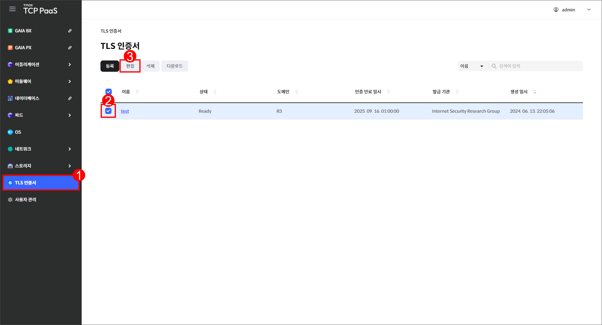

# 7.1 TLS 인증서

## 인증서 화면

메뉴 영역에서 `TLS 인증서`를 클릭하여 TLS 인증서 화면을 확인할 수 있습니다.

<figure><figcaption>
[그림 7.1.1] TLS 인증서 화면 구성
</figcaption></figure>

1.  버튼을 클릭하여 다음을 실행할 수 있습니다.

    <table><thead><tr><th width="123">버튼</th><th width="315">기능</th><th>활성화 조건</th></tr></thead><tbody><tr><td><code>등록</code></td><td>인증서 등록 창을 표시합니다.</td><td>-</td></tr><tr><td><code>편집</code></td><td>선택한 인증서의 편집 창을 표시합니다.</td><td>한 개의 인증서를 선택해야 합니다.</td></tr><tr><td><code>삭제</code></td><td>선택한 인증서의 삭제 창을 표시합니다.</td><td>한 개의 인증서를 선택해야 합니다.</td></tr><tr><td><code>다운로드</code></td><td>선택한 인증서를 다운로드합니다.</td><td>한 개의 인증서를 선택해야 합니다.</td></tr></tbody></table>
2. 드롭다운 메뉴에서 항목을 선택하고 검색어를 입력하여 인증서를 검색할 수 있습니다.
3.  등록한 인증서를 조회할 수 있습니다.

    <table><thead><tr><th width="156">항목</th><th>설명</th></tr></thead><tbody><tr><td>이름</td><td>인증서의 이름</td></tr><tr><td>상태</td><td>
인증서의 상태
<ul><li><code>Ready</code>: 인증서를 사용할 수 있는 상태</li><li><code>Expired</code>: 인증서가 만료된 상태</li></ul></td></tr><tr><td>도메인</td><td>인증서를 발급한 도메인</td></tr><tr><td>인증 만료 일시</td><td>인증서 만료일</td></tr><tr><td>발급 기관</td><td>인증서 발급 기관</td></tr><tr><td>생성 일시</td><td>인증서 등록일</td></tr></tbody></table>
4. 체크 박스를 클릭하여 인증서를 선택할 수 있습니다.
5. 인증서의 이름을 클릭하면 해당 인증서의 상세 페이지로 이동합니다.

***

## 인증서 등록

<figure><figcaption>
[그림 7.1.2] TLS 인증서 등록 버튼
</figcaption></figure>

1. 메뉴 영역에서 `TLS 인증서`를 클릭합니다.
2. TLS 인증서 페이지가 열리면 `등록`을 클릭합니다.

<figure><figcaption>
[그림 7.1.3] TLS 인증서 등록 창
</figcaption></figure>

3.  등록할 인증서의 정보를 입력합니다.&#x20;

    <table><thead><tr><th width="139">항목</th><th>설명</th></tr></thead><tbody><tr><td>이름 <mark style="color:red;">*</mark></td><td>인증서의 이름</td></tr><tr><td>개인 키 <mark style="color:red;">*</mark></td><td>인증서 Private key</td></tr><tr><td>인증서 <mark style="color:red;">*</mark></td><td>인증서 Certificate key</td></tr><tr><td>인증서 체인</td><td>인증서 Certificate Chain</td></tr></tbody></table>
4. 입력을 완료한 후 `저장`을 클릭합니다.

***

## 인증서 편집

<figure><figcaption>
[그림 7.1.4] TLS 인증서 편집 버튼
</figcaption></figure>

1. 메뉴 영역에서 `TLS 인증서`를 클릭합니다.
2. 편집할 인증서에 체크합니다.
3. `편집`을 클릭합니다.

\[그림 7.1.5] TLS 인증서 편집 창

4.  다음 항목을 편집할 수 있습니다.

    <table><thead><tr><th width="134">항목</th><th>설명</th></tr></thead><tbody><tr><td>이름 <mark style="color:red;">*</mark></td><td>인증서의 이름</td></tr><tr><td>개인 키 <mark style="color:red;">*</mark></td><td>인증서 Private key</td></tr><tr><td>인증서 <mark style="color:red;">*</mark></td><td>인증서 Certificate key</td></tr><tr><td>인증서 체인</td><td>인증서 Certificate Chain</td></tr></tbody></table>
5. 편집을 완료한 후 `저장`을 클릭합니다.

***

## 인증서 삭제

<figure><figcaption>
[그림 7.1.6] TLS 인증서 삭제 창
</figcaption></figure>

1. 메뉴 영역에서 `TLS 인증서`를 클릭합니다.
2. 삭제할 인증서에 체크한 후 `삭제`를 클릭합니다.
3. 삭제 창이 열리면 `삭제`를 클릭합니다.

***

## 인증서 다운로드

<figure><figcaption>
[그림 7.1.7] TLS 인증서 다운로드 버튼
</figcaption></figure>

1. 메뉴 영역에서 `TLS 인증서`를 클릭합니다.
2. 다운로드할 인증서에 체크합니다.
3. `다운로드`를 클릭합니다.

***

## 인증서 상세

<figure><figcaption>
[그림 7.1.8] TLS 인증서 조회 페이지
</figcaption></figure>

1. 메뉴 영역에서 `TLS 인증서`를 클릭합니다.
2. 상세 정보를 확인할 인증서의 이름을 클릭합니다.

<figure><figcaption>
[그림 7.1.9] 인증서 상세 페이지
</figcaption></figure>

3.  버튼을 클릭하여 다음을 실행할 수 있습니다.

    <table><thead><tr><th width="185">버튼</th><th>기능</th></tr></thead><tbody><tr><td><code>액션</code> > <code>편집</code></td><td>해당 인증서의 편집 창을 표시합니다.</td></tr><tr><td><code>액션</code> > <code>삭제</code></td><td>해당 인증서의 삭제 창을 표시합니다.</td></tr><tr><td><code>액션</code> > <code>다운로드</code></td><td>해당 인증서를 다운로드합니다.</td></tr></tbody></table>
4.  인증서의 상세 정보를 조회할 수 있습니다.&#x20;

    <table><thead><tr><th width="183">항목</th><th>설명</th></tr></thead><tbody><tr><td>이름</td><td>인증서의 이름</td></tr><tr><td>상태</td><td>
인증서의 상태
<ul><li><code>Ready</code>: 인증서를 사용할 수 있는 상태</li><li><code>Expired</code>: 인증서가 만료된 상태</li></ul></td></tr><tr><td>발급 일시</td><td>인증서 발급일</td></tr><tr><td>등록 일시</td><td>인증서 등록일</td></tr><tr><td>도메인</td><td>인증서를 발급한 도메인</td></tr><tr><td>인증 시작 일시</td><td>인증 시작일</td></tr><tr><td>공공 키 정보</td><td>공공 키 정보</td></tr><tr><td>인증 만료 일시</td><td>인증서 만료일</td></tr><tr><td>발급 기관</td><td>인증서 발급 기관</td></tr><tr><td>시그니처 알고리즘</td><td>인증서 서명 알고리즘</td></tr></tbody></table>
